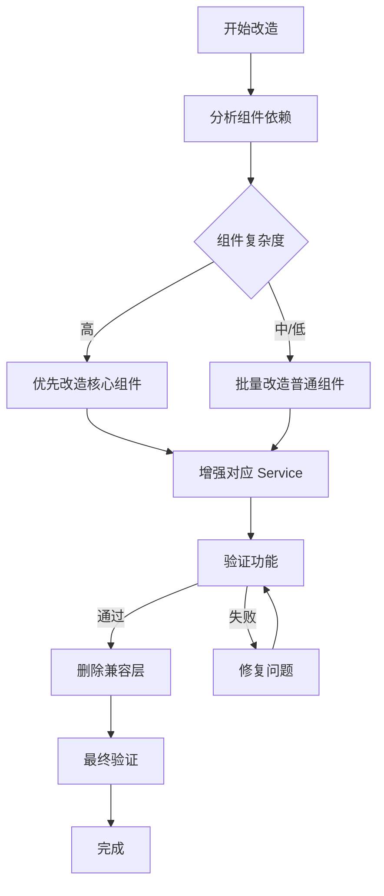

# 完全脱离 Supabase 技术设计文档

## 1. 系统概要 (System Summary)

本次改造将完全移除项目中所有 Supabase 相关代码，包括：
1. 改造 30 个组件，将 `supabase.from()` 调用替换为 `xxxService.xxx()`
2. 增强现有 Service 层，添加缺失的方法
3. 删除 `src/lib/supabase.ts` 兼容层
4. 确保所有功能正常工作

改造后架构：纯 REST API + Service Layer，无任何 Supabase 依赖。

## 2. 决策记录 (Decision Rationale)

### 原方案选择
- **方案 A**: 保留兼容层，逐步迁移
  - 优点：风险低，可分阶段实施
  - 缺点：技术债务长期存在，架构不清晰
  
- **方案 B**: 一次性完全移除（本次选择）
  - 优点：架构彻底清晰，无技术债务
  - 缺点：工作量大，需要充分测试

**选择方案 B 的原因**：
1. 已有 11 个 Service 作为基础，改造有坚实基础
2. 兼容层增加了维护复杂度，长期看不划算
3. 一次性改造后，后续开发更清晰

### 权衡 (Trade-offs)
- **牺牲**：短期内需要投入较多时间（25-35小时）
- **换取**：长期维护成本降低，架构清晰，无技术债务

## 3. 详细设计 (Detailed Design)

### 3.1 逻辑流程 (Logic Flow)



### 3.2 改造策略

#### 阶段 1: 核心组件改造（优先级高）
1. TaskDetailPage - 任务详情页
2. TaskCreatePage - 任务创建页
3. TaskDetail - 任务详情组件
4. ProjectOverview - 项目概览
5. ProjectCreate - 项目创建
6. AuthContext - 认证上下文

#### 阶段 2: 业务组件改造（优先级中）
1. Milestones, Risks, Suppliers
2. ForumTab, ForumPostDetailPage
3. SupplierList, ClientList
4. Notifications, FileUploadButton

#### 阶段 3: 系统组件改造（优先级低）
1. MilestoneTemplates, AIConfig
2. ReportTemplates, ReportEditor
3. 测试文件

### 3.3 目录与模块结构

改造后结构：
```
src/
├── lib/
│   └── api.ts              # 仅保留 API 客户端，删除 supabase.ts
├── services/               # 增强后的服务层
│   ├── index.ts
│   ├── authService.ts      # 增强认证方法
│   ├── userService.ts
│   ├── roleService.ts
│   ├── taskService.ts      # 增强复杂查询
│   ├── projectService.ts   # 增强统计查询
│   ├── fileService.ts      # 完整 Storage 替代
│   ├── systemService.ts
│   ├── forumService.ts
│   ├── supplierService.ts
│   ├── clientService.ts
│   ├── analysisService.ts
│   └── notificationService.ts  # 新增
├── types/
│   └── ...                 # 已有类型定义
└── pages/                  # 改造后的组件
    └── ...                 # 无 supabase 导入
```

### 3.4 Service 增强设计

#### taskService 增强
```typescript
// 新增方法
getTasksByProject(projectId: string): Promise<Task[]>
getTasksByAssignee(userId: string): Promise<Task[]>
getTaskWithDetails(taskId: string): Promise<TaskDetail>
batchUpdateTasks(taskIds: string[], data: Partial<Task>): Promise<void>
searchTasks(params: SearchTaskParams): Promise<{ tasks: Task[]; total: number }>
```

#### projectService 增强
```typescript
// 新增方法
getProjectStats(projectId: string): Promise<ProjectStats>
getProjectMembers(projectId: string): Promise<ProjectMember[]>
addProjectMember(projectId: string, userId: string, role: string): Promise<void>
removeProjectMember(memberId: string): Promise<void>
getProjectProgress(projectId: string): Promise<number>
```

#### fileService 增强
```typescript
// 新增方法
uploadMultipleFiles(files: File[], folderId?: string): Promise<FileRecord[]>
getStorageQuota(): Promise<{ used: number; total: number }>
moveFile(fileId: string, targetFolderId: string): Promise<void>
copyFile(fileId: string, targetFolderId: string): Promise<FileRecord>
```

#### notificationService 新增
```typescript
// 新增服务
getNotifications(userId: string): Promise<Notification[]>
getUnreadCount(userId: string): Promise<number>
markAsRead(notificationId: string): Promise<void>
markAllAsRead(userId: string): Promise<void>
deleteNotification(notificationId: string): Promise<void>
```

### 3.5 组件改造模式

#### 模式 1: 简单查询替换
```typescript
// 改造前
const { data } = await supabase
  .from('tasks')
  .select('*')
  .eq('project_id', projectId);

// 改造后
const { tasks } = await taskService.getTasks({ projectId });
```

#### 模式 2: 关联查询替换
```typescript
// 改造前
const { data } = await supabase
  .from('tasks')
  .select(`
    *,
    project:projects(id, name),
    assignees:task_assignees(user_id)
  `)
  .eq('id', taskId)
  .single();

// 改造后
const task = await taskService.getTaskById(taskId);
```

#### 模式 3: 插入操作替换
```typescript
// 改造前
const { data } = await supabase
  .from('tasks')
  .insert({ title, project_id: projectId })
  .select()
  .single();

// 改造后
const task = await taskService.createTask({
  title,
  project_id: projectId
});
```

#### 模式 4: 更新操作替换
```typescript
// 改造前
const { data } = await supabase
  .from('tasks')
  .update({ status })
  .eq('id', taskId);

// 改造后
await taskService.updateTask(taskId, { status });
```

#### 模式 5: 删除操作替换
```typescript
// 改造前
await supabase.from('tasks').delete().eq('id', taskId);

// 改造后
await taskService.deleteTask(taskId);
```

## 4. 安全性与异常处理 (Security & Error Handling)

### 4.1 防御性编程
- 所有 Service 方法添加 try-catch 包裹
- 返回类型统一使用 `Promise<T | null>` 或 `Promise<T[]>`
- 空数据处理：查询无结果返回空数组或 null，不抛出错误

### 4.2 错误处理统一
```typescript
// Service 层统一错误处理
try {
  const data = await api.db.from('tasks').select('*');
  return data || [];
} catch (error) {
  console.error('TaskService.getTasks error:', error);
  return []; // 返回默认值，不抛出错误
}
```

### 4.3 权限校验
- 保留现有的权限校验逻辑
- 在 Service 层调用前检查用户权限
- 敏感操作需要管理员权限

## 5. 验证方案 (Verification Plan)

### 5.1 自动化检查
```bash
# 1. 检查是否还有 supabase 导入
grep -r "from.*supabase" src/ --include="*.ts" --include="*.tsx" | grep -v "node_modules"

# 2. 检查是否还有 supabase 关键字
grep -r "supabase\." src/ --include="*.ts" --include="*.tsx" | grep -v "node_modules"

# 3. TypeScript 类型检查
npm run check
```

### 5.2 功能验证清单

#### 核心功能
- [ ] 登录/登出
- [ ] 用户管理
- [ ] 角色权限管理

#### 任务管理
- [ ] 任务列表
- [ ] 任务创建
- [ ] 任务详情
- [ ] 任务更新
- [ ] 任务删除

#### 项目管理
- [ ] 项目列表
- [ ] 项目创建
- [ ] 项目详情
- [ ] 里程碑管理
- [ ] 风险管理

#### 其他功能
- [ ] 文件管理
- [ ] 论坛功能
- [ ] 供应商管理
- [ ] 客户管理

### 5.3 手动验证步骤
1. 启动前后端服务
2. 登录系统
3. 逐个访问各功能模块
4. 执行增删改查操作
5. 验证数据正确性
