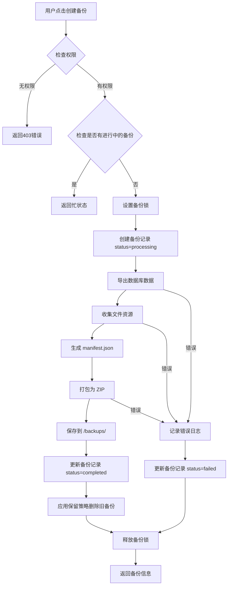
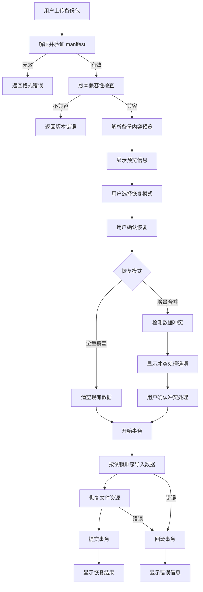
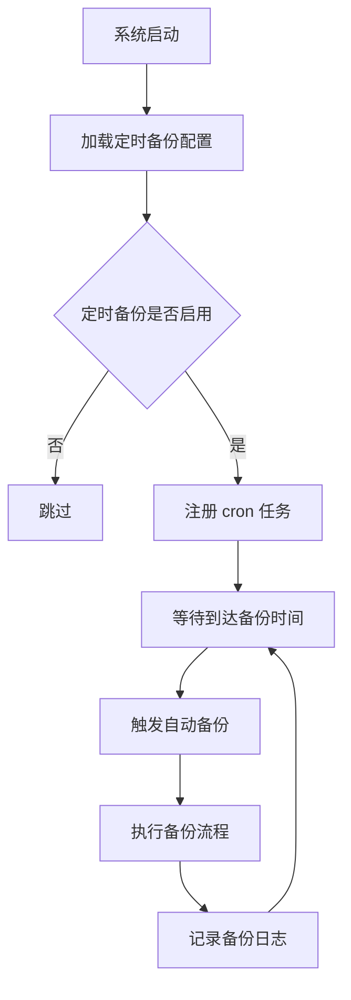

# 系统数据备份与迁移功能技术设计文档

## 1. 系统概要 (System Summary)

本功能为 PMSY 项目管理系统提供完整的数据备份与恢复能力。通过在后端实现数据导出、文件打包、定时任务等核心逻辑，前端提供可视化的备份管理和恢复操作界面，实现一键备份、自动保留策略、全量/增量恢复等能力。

**集成方式：**
- 在「系统设置」页面新增「数据备份」标签页
- 后端新增独立的 Backup Service 模块
- 使用 node-cron 实现定时备份任务
- 使用 JSZip 实现压缩包生成和解压

**涉及模块改动：**
- 前端：`src/pages/system/` 新增备份管理组件
- 后端：`api-new/src/services/` 新增备份服务
- 后端：`api-new/src/routes/` 新增备份路由
- 数据库：新增 `backup_records` 表和 `system_settings` 定时备份配置

## 2. 决策记录 (Decision Rationale)

### 2.1 原方案选择

**对比方案：**

| 方案 | 优点 | 缺点 |
|------|------|------|
| **A. PostgreSQL pg_dump** | 原生支持，数据完整 | 需要 PostgreSQL 客户端，文件资源需单独处理 |
| **B. 应用层导出 JSON + 文件打包** | 灵活可控，跨平台，文件资源一体化 | 需要自行处理数据依赖顺序 |
| **C. 云服务商备份服务** | 自动化程度高 | 依赖特定云厂商，不符合本地部署需求 |

**最终选择：方案 B（应用层导出 JSON + 文件打包）**

**原因：**
1. 项目需要支持本地部署和跨环境迁移，不依赖特定数据库工具
2. 文件资源（上传的文件、头像）需要与数据库数据一起打包
3. 需要支持选择性备份（可选排除日志、通知等数据）
4. 便于实现版本兼容性检查和冲突处理

### 2.2 权衡 (Trade-offs)

| 权衡项 | 选择 | 原因 |
|--------|------|------|
| 备份格式 | ZIP 而非 TAR | ZIP 在 Node.js 生态有更好的支持（JSZip），且 Windows 原生支持 |
| 数据格式 | JSON 而非 SQL | 便于版本兼容性检查，避免 SQL 方言差异 |
| 定时任务 | node-cron 而非系统 cron | 保持 Node.js 单进程部署，简化运维 |
| 文件存储 | 本地文件系统 | 符合当前架构，后续可扩展支持云存储 |
| 恢复事务 | 单个大事务 | 确保数据一致性，但大恢复可能占用较多内存 |

## 3. 详细设计 (Detailed Design)

### 3.1 逻辑流程 (Logic Flow)

#### 备份流程



#### 恢复流程



#### 定时备份流程



### 3.2 目录与模块结构 (Structure)

```
api-new/
├── src/
│   ├── services/
│   │   └── backup/
│   │       ├── BackupService.ts          # 核心备份服务
│   │       ├── RestoreService.ts         # 恢复服务
│   │       ├── FileCollector.ts          # 文件收集器
│   │       └── validators/
│   │           ├── ManifestValidator.ts  # 清单验证
│   │           └── VersionChecker.ts     # 版本检查
│   ├── routes/
│   │   └── system/
│   │       └── backup.routes.ts          # 备份相关路由
│   ├── jobs/
│   │   └── backup.scheduler.ts           # 定时备份任务
│   └── types/
│       └── backup.types.ts               # 类型定义
├── backups/                               # 备份文件存储目录
└── uploads/                               # 临时上传目录

src/
├── pages/
│   └── system/
│       ├── SystemSettings.tsx            # 修改：添加「数据备份」标签
│       └── tabs/
│           └── DataBackup/               # 新增：数据备份标签页
│               ├── index.tsx             # 主组件
│               ├── BackupList.tsx        # 备份列表
│               ├── CreateBackupModal.tsx # 创建备份弹窗
│               ├── RestorePanel.tsx      # 恢复面板
│               └── ScheduleSettings.tsx  # 定时备份设置
├── services/
│   └── backupApi.ts                      # 备份 API 封装
└── types/
    └── backup.ts                         # 备份相关类型
```

### 3.3 数据模型 (Data Models)

#### 数据库表

```sql
-- 备份记录表
CREATE TABLE IF NOT EXISTS backup_records (
    id UUID PRIMARY KEY DEFAULT gen_random_uuid(),
    name TEXT NOT NULL,
    description TEXT,
    file_path TEXT NOT NULL,           -- 备份文件相对路径
    file_size BIGINT NOT NULL,         -- 文件大小（字节）
    manifest JSONB NOT NULL,           -- 备份元数据
    status TEXT DEFAULT 'processing' CHECK (status IN ('pending', 'processing', 'completed', 'failed')),
    error_message TEXT,                -- 失败时的错误信息
    created_by UUID REFERENCES profiles(id),
    created_at TIMESTAMPTZ DEFAULT NOW() NOT NULL,
    completed_at TIMESTAMPTZ
);

-- 创建索引
CREATE INDEX IF NOT EXISTS idx_backup_records_status ON backup_records(status);
CREATE INDEX IF NOT EXISTS idx_backup_records_created_by ON backup_records(created_by);
CREATE INDEX IF NOT EXISTS idx_backup_records_created_at ON backup_records(created_at);

-- 系统设置表扩展（已存在，添加定时备份配置）
-- 在 system_settings 表中添加 key='backup_schedule' 的配置
```

#### TypeScript 类型定义

```typescript
// 备份记录
export interface BackupRecord {
  id: string;
  name: string;
  description?: string;
  filePath: string;
  fileSize: number;
  manifest: BackupManifest;
  status: 'pending' | 'processing' | 'completed' | 'failed';
  errorMessage?: string;
  createdBy: string;
  createdAt: string;
  completedAt?: string;
}

// 备份清单
export interface BackupManifest {
  version: string;                    // 备份格式版本
  appVersion: string;                 // PMSY 应用版本
  dbVersion: string;                  // 数据库迁移版本
  backupAt: string;                   // 备份时间 ISO8601
  description?: string;               // 备份描述
  tables: TableManifest[];            // 表数据清单
  files: FileManifest[];              // 文件清单
  stats: BackupStats;                 // 统计信息
  options: BackupOptions;             // 备份选项
}

// 表数据清单
export interface TableManifest {
  name: string;                       // 表名
  recordCount: number;                // 记录数
  fileName: string;                   // 数据文件名称（如：profiles.json）
  hash: string;                       // 文件哈希（校验用）
}

// 文件清单
export interface FileManifest {
  path: string;                       // 文件在备份包中的路径
  originalPath: string;               // 原始存储路径
  size: number;                       // 文件大小
  hash: string;                       // 文件哈希
}

// 备份统计
export interface BackupStats {
  totalRecords: number;               // 总记录数
  totalFiles: number;                 // 总文件数
  totalFileSize: number;              // 文件总大小
  duration?: number;                  // 备份耗时（毫秒）
}

// 备份选项
export interface BackupOptions {
  includeLogs: boolean;               // 是否包含日志
  includeNotifications: boolean;      // 是否包含通知
  includeForum: boolean;              // 是否包含论坛数据
  encrypt: boolean;                   // 是否加密
}

// 定时备份配置
export interface BackupScheduleConfig {
  enabled: boolean;                   // 是否启用
  cron: string;                       // cron 表达式
  timeZone: string;                   // 时区
  options: BackupOptions;             // 备份选项
  keepCount: number;                  // 保留数量（默认10）
}

// 恢复预览
export interface RestorePreview {
  manifest: BackupManifest;
  conflicts: DataConflict[];          // 数据冲突列表
  warnings: string[];                 // 警告信息
}

// 数据冲突
export interface DataConflict {
  table: string;                      // 冲突表名
  recordId: string;                   // 冲突记录ID
  conflictType: 'duplicate' | 'missing_dependency';
  existingRecord?: unknown;           // 现有记录
  incomingRecord: unknown;            // 导入记录
}

// 恢复结果
export interface RestoreResult {
  success: boolean;
  importedTables: TableImportResult[];
  importedFiles: number;
  errors: string[];
  warnings: string[];
  duration: number;
}

// 表导入结果
export interface TableImportResult {
  table: string;
  total: number;
  imported: number;
  skipped: number;
  failed: number;
}
```

### 3.4 交互接口 (APIs / Props)

#### 后端 API 路由

```typescript
// POST /api/system/backup
// 创建备份
interface CreateBackupRequest {
  name?: string;
  description?: string;
  options?: Partial<BackupOptions>;
}

interface CreateBackupResponse {
  id: string;
  status: string;
  message: string;
}

// GET /api/system/backup
// 获取备份列表
interface GetBackupsResponse {
  backups: BackupRecord[];
  total: number;
}

// GET /api/system/backup/:id
// 获取备份详情
interface GetBackupResponse {
  backup: BackupRecord;
}

// GET /api/system/backup/:id/download
// 下载备份文件（流式响应）

// DELETE /api/system/backup/:id
// 删除备份
interface DeleteBackupResponse {
  success: boolean;
}

// POST /api/system/restore/preview
// 预览备份包
interface PreviewRestoreRequest {
  filePath: string;  // 上传后的临时文件路径
}

interface PreviewRestoreResponse {
  preview: RestorePreview;
}

// POST /api/system/restore
// 执行恢复
interface RestoreRequest {
  filePath: string;
  mode: 'full' | 'merge';
  conflictResolution?: 'skip' | 'overwrite' | 'rename';
  selectedTables?: string[];  // 选择性恢复
}

interface RestoreResponse {
  result: RestoreResult;
}

// GET /api/system/backup/schedule
// 获取定时备份配置
interface GetScheduleResponse {
  config: BackupScheduleConfig;
}

// PUT /api/system/backup/schedule
// 更新定时备份配置
interface UpdateScheduleRequest {
  config: BackupScheduleConfig;
}

interface UpdateScheduleResponse {
  success: boolean;
}

// POST /api/system/backup/:id/verify
// 验证备份包完整性
interface VerifyBackupResponse {
  valid: boolean;
  errors?: string[];
}
```

#### 前端组件 Props

```typescript
// BackupList 组件
interface BackupListProps {
  backups: BackupRecord[];
  loading: boolean;
  onDownload: (backup: BackupRecord) => void;
  onDelete: (backup: BackupRecord) => void;
  onVerify: (backup: BackupRecord) => void;
}

// CreateBackupModal 组件
interface CreateBackupModalProps {
  isOpen: boolean;
  onClose: () => void;
  onConfirm: (data: CreateBackupFormData) => Promise<void>;
  loading: boolean;
}

interface CreateBackupFormData {
  name: string;
  description: string;
  includeLogs: boolean;
  includeNotifications: boolean;
  includeForum: boolean;
}

// RestorePanel 组件
interface RestorePanelProps {
  onPreview: (file: File) => Promise<RestorePreview>;
  onRestore: (data: RestoreFormData) => Promise<RestoreResult>;
  loading: boolean;
}

interface RestoreFormData {
  file: File;
  mode: 'full' | 'merge';
  conflictResolution: 'skip' | 'overwrite' | 'rename';
}

// ScheduleSettings 组件
interface ScheduleSettingsProps {
  config: BackupScheduleConfig;
  onSave: (config: BackupScheduleConfig) => Promise<void>;
  loading: boolean;
}
```

## 4. 安全性与异常处理 (Security & Error Handling)

### 4.1 防御性编程

| 场景 | 处理方式 |
|------|----------|
| 非法输入 | 使用 Zod 进行严格的请求参数校验 |
| 文件过大 | 限制上传文件大小（默认 5GB），超出返回 413 错误 |
| 磁盘空间不足 | 备份前检查磁盘空间，不足时提前终止 |
| 并发备份 | 使用内存锁（Map）确保同一时间只有一个备份任务 |
| 备份中断 | 记录状态为 failed，清理临时文件 |
| 恢复中断 | 事务回滚，保持现有数据不受影响 |
| 恶意备份包 | 验证 manifest 签名，拒绝未知来源的备份包 |

### 4.2 权限校验

```typescript
// 权限中间件
const requireAdmin = (req: Request, res: Response, next: NextFunction) => {
  if (req.user?.role !== 'admin') {
    return res.status(403).json({ error: '仅管理员可操作备份恢复' });
  }
  next();
};

// 路由应用
router.post('/backup', authenticate, requireAdmin, createBackup);
router.post('/restore', authenticate, requireAdmin, restoreBackup);
```

### 4.3 错误处理策略

```typescript
// 备份错误分类
enum BackupErrorCode {
  LOCK_FAILED = 'LOCK_FAILED',           // 获取锁失败
  INSUFFICIENT_SPACE = 'INSUFFICIENT_SPACE', // 空间不足
  DB_EXPORT_FAILED = 'DB_EXPORT_FAILED', // 数据库导出失败
  FILE_COLLECT_FAILED = 'FILE_COLLECT_FAILED', // 文件收集失败
  PACK_FAILED = 'PACK_FAILED',           // 打包失败
  UNKNOWN = 'UNKNOWN'
}

// 恢复错误分类
enum RestoreErrorCode {
  INVALID_MANIFEST = 'INVALID_MANIFEST', // 无效的清单
  VERSION_MISMATCH = 'VERSION_MISMATCH', // 版本不匹配
  DEPENDENCY_MISSING = 'DEPENDENCY_MISSING', // 依赖缺失
  DB_IMPORT_FAILED = 'DB_IMPORT_FAILED', // 数据库导入失败
  FILE_RESTORE_FAILED = 'FILE_RESTORE_FAILED', // 文件恢复失败
  UNKNOWN = 'UNKNOWN'
}
```

## 5. 验证方案 (Verification Plan)

### 5.1 自动化测试

| 测试类型 | 覆盖路径 |
|----------|----------|
| 单元测试 | BackupService.createBackup, RestoreService.preview, validators |
| 集成测试 | 完整备份流程、完整恢复流程、定时备份触发 |
| 边界测试 | 空数据备份、超大文件备份、版本不兼容恢复 |

### 5.2 手动验证步骤

**备份功能验证：**
1. 进入「系统设置」→「数据备份」页面
2. 点击「创建备份」，填写名称和描述
3. 等待备份完成，检查备份列表显示新备份
4. 点击「下载」，验证备份包可正常下载
5. 解压备份包，验证包含 manifest.json 和数据文件

**恢复功能验证：**
1. 在新部署的系统中进入「数据备份」→「数据恢复」
2. 上传备份包，验证预览信息正确显示
3. 选择「全量覆盖」模式，执行恢复
4. 验证数据完整恢复，文件资源正常访问

**定时备份验证：**
1. 设置定时备份为每分钟执行（测试用）
2. 等待定时任务触发
3. 验证自动备份成功创建
4. 验证保留策略生效（只保留最近10个）

**边缘情况验证：**
1. 测试并发备份（应排队或拒绝）
2. 测试磁盘满时的备份（应优雅失败）
3. 测试恢复时断电（数据应不受影响）
