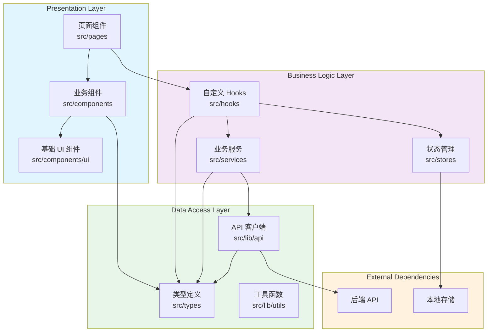
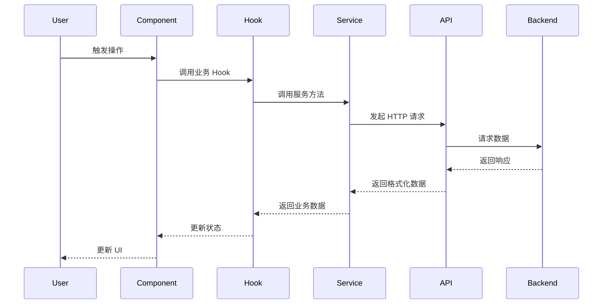
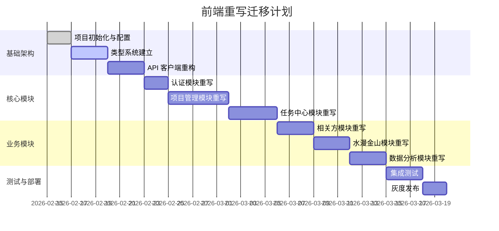

# 前端系统重写技术设计文档

## 1. 系统概要 (System Summary)

本项目前端系统重写采用**分层架构 + 模块化设计**，核心目标是彻底解决当前系统中存在的字段缺失、类型不一致、运行时错误等问题。重写后的系统将保持现有 UI 界面、布局结构和用户操作逻辑完全不变，但在底层实现上进行全面重构：

- **架构层**: 引入清晰的分层架构（表现层、业务逻辑层、数据访问层）
- **类型层**: 建立完整的类型系统，消除所有 `any` 类型
- **数据层**: 统一数据模型和 API 调用规范
- **状态层**: 引入 TanStack Query 优化服务端状态管理
- **错误层**: 建立全局错误边界和统一的错误处理机制

## 2. 决策记录 (Decision Rationale)

### 2.1 技术栈选择

| 技术 | 选择 | 理由 |
|------|------|------|
| **状态管理** | TanStack Query + Zustand | TanStack Query 处理服务端状态（缓存、去重、重试），Zustand 处理客户端状态，比 Redux 更轻量 |
| **路由** | React Router v7 | 保持现有路由配置，无需迁移成本 |
| **UI 组件** | Radix UI + Tailwind CSS | 保持现有组件库，确保 UI 一致性 |
| **表单处理** | React Hook Form + Zod | 类型安全的表单验证，与 TypeScript 完美集成 |
| **HTTP 客户端** | Axios | 支持拦截器、请求/响应转换、错误处理 |
| **日期处理** | date-fns | 函数式 API，Tree-shaking 友好 |

### 2.2 原方案对比

| 方案 | 优点 | 缺点 | 结论 |
|------|------|------|------|
| **渐进式重构** | 风险低，业务不中断 | 周期长，技术债务累积 | ❌ 不适用，当前系统已不可用 |
| **完全重写** | 彻底解决架构问题 | 风险高，需要完整测试 | ✅ 采用，配合灰度发布降低风险 |
| **微前端** | 独立部署，团队自治 | 复杂度高，过度设计 | ❌ 不适用，当前规模不需要 |

### 2.3 权衡 (Trade-offs)

- **牺牲**: 重写期间需要投入较多开发资源，短期内无法新增业务功能
- **换取**: 彻底解决技术债务，大幅提升系统稳定性和可维护性
- **折中**: 采用"模块级重写 + 并行验证"策略，确保业务连续性

## 3. 详细设计 (Detailed Design)

### 3.1 架构设计 (Architecture)



### 3.2 目录结构 (Directory Structure)

```
src/
├── components/                 # 组件目录
│   ├── ui/                    # 基础 UI 组件（Button、Input、Dialog 等）
│   │   ├── button.tsx
│   │   ├── input.tsx
│   │   ├── dialog.tsx
│   │   └── ...
│   ├── layout/                # 布局组件
│   │   ├── MainLayout.tsx
│   │   ├── Sidebar.tsx
│   │   └── Header.tsx
│   ├── common/                # 通用业务组件
│   │   ├── DataTable.tsx
│   │   ├── SearchFilter.tsx
│   │   └── Pagination.tsx
│   └── modules/               # 模块级组件
│       ├── project/
│       ├── task/
│       ├── supplier/
│       └── ...
├── hooks/                     # 自定义 Hooks
│   ├── useAuth.ts            # 认证相关
│   ├── useProjects.ts        # 项目数据
│   ├── useTasks.ts           # 任务数据
│   ├── useSuppliers.ts       # 供应商数据
│   └── useDebounce.ts        # 通用工具
├── lib/                       # 工具库
│   ├── api/                   # API 相关
│   │   ├── client.ts         # Axios 实例
│   │   ├── interceptors.ts   # 拦截器
│   │   └── endpoints/        # API 端点定义
│   │       ├── auth.ts
│   │       ├── projects.ts
│   │       └── ...
│   ├── utils/                 # 工具函数
│   │   ├── format.ts         # 格式化
│   │   ├── validate.ts       # 验证
│   │   └── storage.ts        # 存储
│   └── constants.ts          # 常量定义
├── stores/                    # 状态管理 (Zustand)
│   ├── authStore.ts
│   ├── uiStore.ts
│   └── ...
├── types/                     # 类型定义
│   ├── api.ts                # API 相关类型
│   ├── models/               # 数据模型类型
│   │   ├── user.ts
│   │   ├── project.ts
│   │   ├── task.ts
│   │   └── ...
│   └── common.ts             # 通用类型
├── pages/                     # 页面组件
│   ├── Login.tsx
│   ├── Dashboard.tsx
│   ├── projects/
│   ├── tasks/
│   └── ...
├── providers/                 # Context Providers
│   ├── QueryProvider.tsx     # TanStack Query
│   ├── AuthProvider.tsx      # 认证
│   └── ThemeProvider.tsx     # 主题
├── routes/                    # 路由配置
│   └── index.tsx
├── App.tsx
└── main.tsx
```

### 3.3 数据流设计 (Data Flow)



### 3.4 数据模型 (Data Models)

#### 3.4.1 用户模型
```typescript
// src/types/models/user.ts
export interface User {
  id: string;
  email: string;
  fullName: string;
  avatarUrl: string | null;
  role: UserRole;
  createdAt: string;
  updatedAt: string;
}

export type UserRole = 'admin' | 'manager' | 'member';

export interface AuthState {
  user: User | null;
  isAuthenticated: boolean;
  isLoading: boolean;
}
```

#### 3.4.2 项目模型
```typescript
// src/types/models/project.ts
export interface Project {
  id: string;
  name: string;
  description: string | null;
  status: ProjectStatus;
  amount: number | null;
  managerId: string;
  manager?: User;
  startDate: string | null;
  endDate: string | null;
  progress: number;
  createdAt: string;
  updatedAt: string;
}

export type ProjectStatus = 'pending' | 'in_progress' | 'completed' | 'paused';

export interface ProjectCreateInput {
  name: string;
  description?: string;
  status?: ProjectStatus;
  amount?: number;
  managerId?: string;
  startDate?: string;
  endDate?: string;
}

export interface ProjectUpdateInput extends Partial<ProjectCreateInput> {
  id: string;
}
```

#### 3.4.3 任务模型
```typescript
// src/types/models/task.ts
export interface Task {
  id: string;
  title: string;
  description: string | null;
  status: TaskStatus;
  priority: TaskPriority;
  progress: number;
  projectId: string;
  project?: Project;
  assignees: TaskAssignee[];
  dueDate: string | null;
  createdAt: string;
  updatedAt: string;
}

export type TaskStatus = 'todo' | 'in_progress' | 'paused' | 'done' | 'canceled';
export type TaskPriority = 'low' | 'medium' | 'high' | 'urgent';

export interface TaskAssignee {
  taskId: string;
  userId: string;
  user?: User;
  isPrimary: boolean;
}
```

#### 3.4.4 API 响应类型
```typescript
// src/types/api.ts
export interface ApiResponse<T> {
  data: T;
  message?: string;
  meta?: PaginationMeta;
}

export interface ApiError {
  code: string;
  message: string;
  details?: Record<string, string[]>;
}

export interface PaginationMeta {
  page: number;
  pageSize: number;
  total: number;
  totalPages: number;
}

export interface PaginatedResponse<T> {
  data: T[];
  meta: PaginationMeta;
}
```

### 3.5 核心模块设计

#### 3.5.1 API 客户端设计
```typescript
// src/lib/api/client.ts
import axios, { AxiosInstance, AxiosRequestConfig } from 'axios';

const apiClient: AxiosInstance = axios.create({
  baseURL: import.meta.env.VITE_API_URL,
  timeout: 10000,
  headers: {
    'Content-Type': 'application/json',
  },
});

// 请求拦截器
apiClient.interceptors.request.use(
  (config) => {
    const token = localStorage.getItem('token');
    if (token) {
      config.headers.Authorization = `Bearer ${token}`;
    }
    return config;
  },
  (error) => Promise.reject(error)
);

// 响应拦截器
apiClient.interceptors.response.use(
  (response) => response.data,
  (error) => {
    if (error.response?.status === 401) {
      // 处理认证错误
      window.location.href = '/login';
    }
    return Promise.reject(error);
  }
);

export default apiClient;
```

#### 3.5.2 TanStack Query Hooks 设计
```typescript
// src/hooks/useProjects.ts
import { useQuery, useMutation, useQueryClient } from '@tanstack/react-query';
import { projectService } from '@/services/projectService';
import type { Project, ProjectCreateInput, ProjectUpdateInput } from '@/types/models/project';

const PROJECTS_KEY = 'projects';

export function useProjects(params?: { status?: string; page?: number; pageSize?: number }) {
  return useQuery({
    queryKey: [PROJECTS_KEY, params],
    queryFn: () => projectService.getProjects(params),
  });
}

export function useProject(id: string) {
  return useQuery({
    queryKey: [PROJECTS_KEY, id],
    queryFn: () => projectService.getProject(id),
    enabled: !!id,
  });
}

export function useCreateProject() {
  const queryClient = useQueryClient();
  
  return useMutation({
    mutationFn: (data: ProjectCreateInput) => projectService.createProject(data),
    onSuccess: () => {
      queryClient.invalidateQueries({ queryKey: [PROJECTS_KEY] });
    },
  });
}

export function useUpdateProject() {
  const queryClient = useQueryClient();
  
  return useMutation({
    mutationFn: ({ id, data }: { id: string; data: ProjectUpdateInput }) => 
      projectService.updateProject(id, data),
    onSuccess: (_, variables) => {
      queryClient.invalidateQueries({ queryKey: [PROJECTS_KEY, variables.id] });
      queryClient.invalidateQueries({ queryKey: [PROJECTS_KEY] });
    },
  });
}
```

#### 3.5.3 错误边界设计
```typescript
// src/components/ErrorBoundary.tsx
import { Component, type ErrorInfo, type ReactNode } from 'react';
import { ErrorFallback } from './ErrorFallback';

interface Props {
  children: ReactNode;
  fallback?: ReactNode;
}

interface State {
  hasError: boolean;
  error: Error | null;
}

export class ErrorBoundary extends Component<Props, State> {
  state: State = { hasError: false, error: null };

  static getDerivedStateFromError(error: Error): State {
    return { hasError: true, error };
  }

  componentDidCatch(error: Error, errorInfo: ErrorInfo) {
    console.error('ErrorBoundary caught an error:', error, errorInfo);
    // 可以在这里发送错误日志到监控服务
  }

  render() {
    if (this.state.hasError) {
      return this.props.fallback || <ErrorFallback error={this.state.error} />;
    }

    return this.props.children;
  }
}
```

## 4. 安全性与异常处理 (Security & Error Handling)

### 4.1 防御性编程

#### 4.1.1 数据验证
```typescript
// 使用 Zod 进行运行时数据验证
import { z } from 'zod';

const ProjectSchema = z.object({
  id: z.string().uuid(),
  name: z.string().min(1).max(200),
  status: z.enum(['pending', 'in_progress', 'completed', 'paused']),
  amount: z.number().nullable(),
  createdAt: z.string().datetime(),
});

export type Project = z.infer<typeof ProjectSchema>;

// API 响应验证
export function validateProject(data: unknown): Project {
  return ProjectSchema.parse(data);
}
```

#### 4.1.2 错误处理策略
```typescript
// src/lib/errors.ts
export class AppError extends Error {
  constructor(
    message: string,
    public code: string,
    public statusCode?: number,
    public details?: Record<string, string[]>
  ) {
    super(message);
    this.name = 'AppError';
  }
}

export function handleApiError(error: unknown): AppError {
  if (error instanceof AppError) {
    return error;
  }
  
  if (error instanceof Error) {
    return new AppError(error.message, 'UNKNOWN_ERROR');
  }
  
  return new AppError('发生未知错误', 'UNKNOWN_ERROR');
}
```

### 4.2 权限校验

```typescript
// src/hooks/usePermission.ts
import { useAuthStore } from '@/stores/authStore';

export function usePermission() {
  const { user } = useAuthStore();

  const hasRole = (role: string) => user?.role === role;
  const hasAnyRole = (roles: string[]) => roles.includes(user?.role || '');
  
  return { hasRole, hasAnyRole };
}

// 路由守卫组件
export function ProtectedRoute({ children, requiredRole }: ProtectedRouteProps) {
  const { isAuthenticated, user } = useAuthStore();
  const location = useLocation();

  if (!isAuthenticated) {
    return <Navigate to="/login" state={{ from: location }} replace />;
  }

  if (requiredRole && user?.role !== requiredRole) {
    return <Navigate to="/unauthorized" replace />;
  }

  return children;
}
```

## 5. 验证方案 (Verification Plan)

### 5.1 自动化测试

#### 5.1.1 测试策略
| 测试类型 | 工具 | 覆盖率目标 | 说明 |
|----------|------|------------|------|
| 单元测试 | Vitest | > 80% | 测试工具函数、Hooks、Services |
| 组件测试 | React Testing Library | > 70% | 测试组件渲染和交互 |
| 集成测试 | MSW + Vitest | > 60% | 测试模块间协作 |
| E2E 测试 | Playwright | 核心流程 | 测试关键业务流程 |

#### 5.1.2 测试示例
```typescript
// src/hooks/__tests__/useProjects.test.ts
import { renderHook, waitFor } from '@testing-library/react';
import { QueryClient, QueryClientProvider } from '@tanstack/react-query';
import { useProjects } from '../useProjects';
import { projectService } from '@/services/projectService';

vi.mock('@/services/projectService');

const wrapper = ({ children }: { children: React.ReactNode }) => (
  <QueryClientProvider client={new QueryClient()}>{children}</QueryClientProvider>
);

describe('useProjects', () => {
  it('should fetch projects successfully', async () => {
    const mockProjects = [{ id: '1', name: 'Test Project' }];
    vi.mocked(projectService.getProjects).mockResolvedValue(mockProjects);

    const { result } = renderHook(() => useProjects(), { wrapper });

    await waitFor(() => {
      expect(result.current.data).toEqual(mockProjects);
    });
  });
});
```

### 5.2 手动验证清单

#### 5.2.1 功能验证
- [ ] 用户登录/登出流程正常
- [ ] 项目列表加载和筛选正常
- [ ] 项目创建/编辑/删除正常
- [ ] 任务管理功能完整可用
- [ ] 供应商/客户管理正常
- [ ] 文件上传/下载正常
- [ ] 数据分析页面数据展示正确

#### 5.2.2 错误处理验证
- [ ] 网络断开时显示友好提示
- [ ] 401 错误自动跳转登录页
- [ ] 表单验证错误正确显示
- [ ] 服务器 500 错误正确处理

#### 5.2.3 性能验证
- [ ] 首屏加载时间 < 3秒
- [ ] 列表页滚动流畅无卡顿
- [ ] 大数据量（>1000条）分页正常
- [ ] 频繁操作无内存泄漏

## 6. 迁移策略 (Migration Strategy)

### 6.1 渐进式迁移方案



### 6.2 模块优先级

| 优先级 | 模块 | 说明 |
|--------|------|------|
| P0 | 认证模块 | 所有功能的基础依赖 |
| P0 | 项目管理 | 核心业务模块 |
| P0 | 任务中心 | 核心业务模块 |
| P1 | 供应商/客户 | 重要业务模块 |
| P1 | 水漫金山 | 独立模块 |
| P1 | 数据分析 | 数据展示模块 |
| P2 | 系统管理 | 低频使用模块 |
| P2 | 文件管理 | 独立模块 |

### 6.3 回滚策略

- **蓝绿部署**: 新旧系统并行运行，可随时切换
- **特性开关**: 使用 Feature Flag 控制新功能上线
- **数据兼容**: 确保新旧系统数据格式兼容
- **监控告警**: 关键指标异常时自动回滚

## 7. 进度规划 (Timeline)

### 7.1 总体时间线

| 阶段 | 时间 | 里程碑 |
|------|------|--------|
| **Phase 1: 基础架构** | 第 1-2 周 | 完成项目初始化、类型系统、API 客户端 |
| **Phase 2: 核心模块** | 第 3-5 周 | 完成认证、项目、任务三大核心模块 |
| **Phase 3: 业务模块** | 第 6-8 周 | 完成所有业务模块重写 |
| **Phase 4: 测试优化** | 第 9-10 周 | 完成测试覆盖、性能优化 |
| **Phase 5: 灰度上线** | 第 11-12 周 | 灰度发布、问题修复、全量上线 |

### 7.2 详细任务分解

详见 [tasks.md](./tasks.md) 文件
