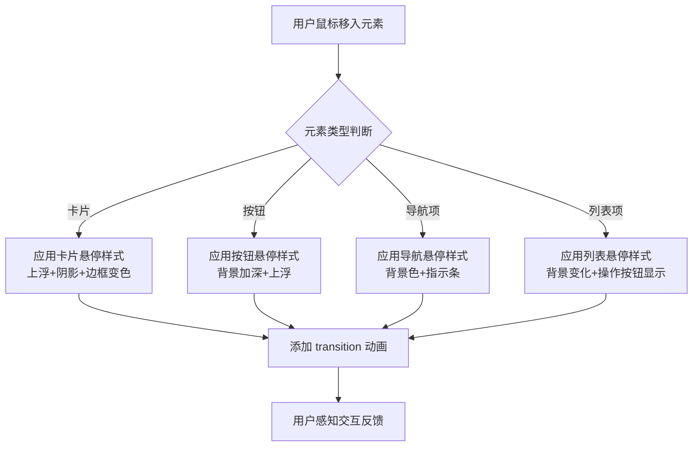

# 系统全局鼠标悬停交互效果 技术设计文档

## 1. 系统概要 (System Summary)

本功能通过统一的 CSS 类名和 Tailwind 工具类，为 PMSY 系统所有可交互元素添加一致的悬停效果。采用"配置化 + 组件化"的设计思路，通过扩展 Tailwind 配置和封装通用交互组件，实现全局一致的悬停体验。

**核心技术路线：**
- 使用 Tailwind CSS 的 `hover:` 变体实现基础悬停效果
- 通过 `transition-all duration-200 ease-out` 统一动画参数
- 封装 `InteractiveCard`、`NavItem`、`HoverButton` 等通用组件
- 使用 CSS 自定义属性支持主题色动态切换
- 通过 `@media (hover: hover)` 支持触摸设备适配

**涉及模块：**
- 全局样式配置 (tailwind.config.js)
- 通用交互组件库 (src/components/interactive/)
- 各业务页面组件改造

## 2. 决策记录 (Decision Rationale)

### 2.1 方案对比

| 方案 | 优点 | 缺点 | 结论 |
|------|------|------|------|
| **A. 纯 Tailwind 类名** | 简单直接，无需额外代码 | 重复代码多，维护困难 | ❌ 放弃 |
| **B. CSS-in-JS (styled-components)** | 动态能力强 | 增加运行时开销，与现有技术栈不符 | ❌ 放弃 |
| **C. 封装通用组件 + Tailwind** | 复用性强，维护简单，性能优秀 | 需要前期设计组件 API | ✅ **采用** |

### 2.2 权衡 (Trade-offs)

- **灵活性 vs 一致性**: 牺牲部分个性化需求，换取全局统一的交互体验
- **开发速度 vs 长期维护**: 前期投入时间设计组件，后期各页面快速复用
- **文件大小 vs 功能丰富**: 使用 Tree-shaking 确保未使用的组件不打包

## 3. 详细设计 (Detailed Design)

### 3.1 逻辑流程 (Logic Flow)



### 3.2 目录与模块结构

```
src/
├── components/
│   ├── interactive/              # 新增：交互组件库
│   │   ├── InteractiveCard.tsx   # 通用悬停卡片
│   │   ├── HoverButton.tsx       # 悬停按钮
│   │   ├── NavItem.tsx           # 导航项
│   │   ├── ListItem.tsx          # 列表项
│   │   └── Avatar.tsx            # 头像组件
│   └── ...
├── styles/
│   └── interactions.css          # 新增：交互效果 CSS
├── lib/
│   └── utils.ts                  # 已有：工具函数
└── pages/
    └── ...                       # 各页面改造
```

### 3.3 数据模型 (Data Models)

```typescript
/**
 * 悬停效果配置接口
 */
export interface HoverEffectConfig {
  /** 主题色 */
  theme: 'primary' | 'mint' | 'sun' | 'violet' | 'dark' | 'red';
  /** 元素类型 */
  type: 'card' | 'button' | 'nav' | 'list' | 'tab' | 'avatar';
  /** 尺寸 */
  size?: 'sm' | 'md' | 'lg';
  /** 是否禁用悬停效果 */
  disabled?: boolean;
}

/**
 * 交互卡片 Props
 */
export interface InteractiveCardProps {
  children: React.ReactNode;
  theme?: HoverEffectConfig['theme'];
  /** 是否可点击 */
  clickable?: boolean;
  /** 点击回调 */
  onClick?: () => void;
  /** 自定义类名 */
  className?: string;
  /** 是否显示左侧指示条 */
  showIndicator?: boolean;
}

/**
 * 悬停按钮 Props
 */
export interface HoverButtonProps {
  children: React.ReactNode;
  variant?: 'primary' | 'secondary' | 'danger' | 'ghost';
  size?: 'sm' | 'md' | 'lg';
  onClick?: () => void;
  disabled?: boolean;
  className?: string;
}

/**
 * 导航项 Props
 */
export interface NavItemProps {
  icon: React.ComponentType<{ className?: string }>;
  label: string;
  href: string;
  theme?: HoverEffectConfig['theme'];
  active?: boolean;
}
```

### 3.4 交互接口 (APIs / Props)

#### 3.4.1 InteractiveCard 组件

```typescript
// 使用示例
<InteractiveCard 
  theme="primary"
  clickable
  onClick={handleClick}
  showIndicator
>
  <PostContent />
</InteractiveCard>

// 生成的 CSS 类
// hover:-translate-y-0.5 hover:shadow-lg hover:border-primary-300
// transition-all duration-200 ease-out
```

#### 3.4.2 HoverButton 组件

```typescript
// 使用示例
<HoverButton variant="primary" size="md" onClick={handleClick}>
  <Plus className="w-4 h-4" />
  新建任务
</HoverButton>

// 生成的 CSS 类 (primary variant)
// hover:bg-primary-700 hover:-translate-y-px hover:shadow-md
// active:scale-95 transition-all duration-200 ease-out
```

#### 3.4.3 NavItem 组件

```typescript
// 使用示例
<NavItem 
  icon={LayoutDashboard}
  label="工作台"
  href="/"
  theme="primary"
  active={isActive}
/>

// 生成的 CSS 类 (hover状态)
// hover:bg-primary-50 hover:text-primary-700
// before:hover:w-[3px] before:hover:bg-primary-500
// transition-all duration-200 ease-out
```

### 3.5 样式规范

#### 3.5.1 基础过渡动画
```css
/* 全局过渡类 */
.interactive-transition {
  @apply transition-all duration-200 ease-out;
}

/* 减少动画偏好支持 */
@media (prefers-reduced-motion: reduce) {
  .interactive-transition {
    @apply transition-none;
  }
}

/* 触摸设备适配 */
@media (hover: none) {
  .interactive-hover {
    @apply transform-none shadow-none;
  }
}
```

#### 3.5.2 主题色映射
```typescript
const themeColorMap = {
  primary: {
    hoverBg: 'hover:bg-primary-50',
    hoverText: 'hover:text-primary-700',
    hoverBorder: 'hover:border-primary-300',
    indicator: 'before:bg-primary-500',
  },
  mint: {
    hoverBg: 'hover:bg-mint-50',
    hoverText: 'hover:text-mint-700',
    hoverBorder: 'hover:border-mint-300',
    indicator: 'before:bg-mint-500',
  },
  sun: {
    hoverBg: 'hover:bg-sun-50',
    hoverText: 'hover:text-sun-700',
    hoverBorder: 'hover:border-sun-300',
    indicator: 'before:bg-sun-500',
  },
  violet: {
    hoverBg: 'hover:bg-violet-50',
    hoverText: 'hover:text-violet-700',
    hoverBorder: 'hover:border-violet-300',
    indicator: 'before:bg-violet-500',
  },
  dark: {
    hoverBg: 'hover:bg-dark-100',
    hoverText: 'hover:text-dark-800',
    hoverBorder: 'hover:border-dark-300',
    indicator: 'before:bg-dark-500',
  },
  red: {
    hoverBg: 'hover:bg-red-50',
    hoverText: 'hover:text-red-600',
    hoverBorder: 'hover:border-red-300',
    indicator: 'before:bg-red-500',
  },
};
```

## 4. 安全性与异常处理 (Security & Error Handling)

### 4.1 防御性编程

- **非法输入处理**: 组件 Props 使用 TypeScript 严格类型检查，非法值使用默认值兜底
- **性能保护**: 使用 `will-change-transform` 优化动画性能，避免重排重绘
- **内存泄漏防护**: 组件卸载时清理事件监听器和动画状态

### 4.2 可访问性保障

- **键盘导航**: 所有悬停效果同时支持 `:focus-visible` 状态
- **屏幕阅读器**: 交互元素保持语义化标签，不依赖悬停效果传递信息
- **减少动画**: 自动检测 `prefers-reduced-motion` 并禁用动画

### 4.3 浏览器兼容性

- **特性检测**: 使用 CSS `@supports` 检测高级特性
- **降级方案**: 旧浏览器保持基础样式，高级效果优雅降级

## 5. 验证方案 (Verification Plan)

### 5.1 自动化测试

```typescript
// InteractiveCard.test.tsx
import { render, screen, fireEvent } from '@testing-library/react';
import { InteractiveCard } from './InteractiveCard';

describe('InteractiveCard', () => {
  it('should apply hover styles on mouse enter', () => {
    render(<InteractiveCard>Content</InteractiveCard>);
    const card = screen.getByTestId('interactive-card');
    
    fireEvent.mouseEnter(card);
    expect(card).toHaveClass('hover:-translate-y-0.5');
  });

  it('should respect reduced motion preference', () => {
    // 模拟用户偏好减少动画
    window.matchMedia = jest.fn().mockImplementation(query => ({
      matches: query === '(prefers-reduced-motion: reduce)',
    }));
    
    render(<InteractiveCard>Content</InteractiveCard>);
    const card = screen.getByTestId('interactive-card');
    
    expect(card).not.toHaveClass('transition-all');
  });
});
```

### 5.2 手动验证清单

- [ ] 侧边栏导航项悬停：背景变色 + 左侧指示条
- [ ] 帖子卡片悬停：上浮 + 阴影加深 + 边框变色
- [ ] 分类标签悬停：背景加深 + 文字变色
- [ ] 主要按钮悬停：背景加深 + 上浮 + 阴影
- [ ] 次要按钮悬停：背景变色 + 图标放大
- [ ] Tab 导航悬停：底部边框渐显
- [ ] 列表项悬停：背景变化 + 操作按钮显示
- [ ] 头像悬停：放大 + 边框光环
- [ ] 触摸设备：悬停效果不影响点击
- [ ] 减少动画偏好：动画被禁用

### 5.3 性能验证

- [ ] Lighthouse Performance 评分不降低
- [ ] 页面滚动时动画流畅无卡顿
- [ ] 大量列表项悬停时无性能问题
