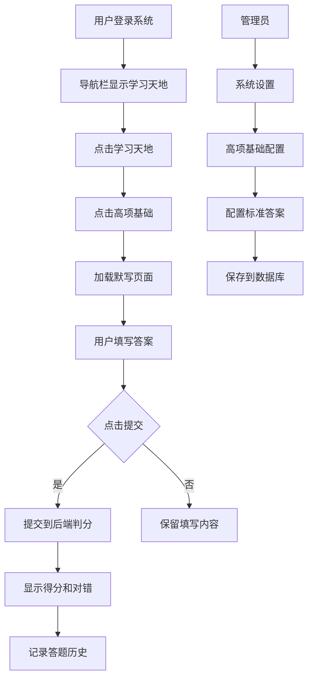

# 学习天地-高项基础 技术设计文档

## 1. 系统概要 (System Summary)
> 本功能为系统增加一个登录后可访问的学习模块，用于软考高项知识点的默写练习。
> - **技术栈**: React + TypeScript + Supabase
> - **路由**: 使用 React Router 管理，新增 /learning 路由
> - **权限**: 登录后可访问（公开模块），管理端可配置标准答案
> - **数据存储**: 使用 Supabase 数据库存储题目数据、用户答题记录

## 2. 决策记录 (Decision Rationale)
- **访问权限**: 登录用户均可访问"学习天地"，无需特殊权限
- **导航方案**: 在现有 Layout 导航栏增加"学习天地"下拉菜单，包含"高项基础"二级菜单
- **答案配置**: 标准答案通过管理后台的"系统设置"中"高项基础配置"页面管理，方便管理员随时调整
- **页面布局**: 使用标签页（Tabs）展示五大过程组，每个过程组下展示对应的知识领域和过程
- **判分策略**: 前后端结合判分，后端存储标准答案，前端展示结果
- **存储方案**: 
  - 题目数据（五大过程组、十大知识领域、49个过程）存储在数据库，只读
  - 用户答题记录存储在数据库，用于统计

## 3. 详细设计 (Detailed Design)

### 3.1 逻辑流程 (Logic Flow)


### 3.2 目录与模块结构 (Structure)
```
src/
├── components/
│   └── theme/
│       └── ThemedModal.tsx          # 复用现有Modal组件
├── pages/
│   ├── learning/                   # 新增学习模块
│   │   ├── LearningLayout.tsx      # 学习模块布局（含导航）
│   │   ├── HighLevelBasic.tsx      # 高项基础默写页面
│   │   ├── components/
│   │   │   ├── ProcessGroupTabs.tsx    # 过程组标签页
│   │   │   ├── KnowledgeArea.tsx       # 知识领域组件
│   │   │   ├── ProcessItem.tsx         # 过程项组件（输入框）
│   │   │   └── ResultSummary.tsx      # 结果汇总组件
│   │   └── data/
│   │       └── highLevelData.ts    # 49个过程标准答案数据（初始模板）
│   └── system/                     # 现有系统设置模块
│       └── tabs/
│           └── HighLevelConfig.tsx  # 新增：高项基础配置页面
├── services/
│   ├── learningService.ts          # 学习模块API服务
│   └── systemService.ts            # 复用系统服务
├── types/
│   └── learning.ts                 # 类型定义
```

### 3.3 数据模型 (Data Models)

#### 数据库表设计

**表1: high_level_processes (高项过程 - 题目数据)**
```sql
CREATE TABLE IF NOT EXISTS high_level_processes (
  id UUID PRIMARY KEY DEFAULT gen_random_uuid(),
  process_group VARCHAR(50) NOT NULL,      -- 过程组名称
  knowledge_area VARCHAR(50) NOT NULL,      -- 知识领域名称
  process_name VARCHAR(100) NOT NULL,       -- 过程名称
  display_order INTEGER NOT NULL DEFAULT 0, -- 排序
  created_at TIMESTAMPTZ DEFAULT NOW()
);

-- 索引
CREATE INDEX idx_process_group ON high_level_processes(process_group);
CREATE INDEX idx_knowledge_area ON high_level_processes(knowledge_area);

-- 初始数据（仅示例，实际由管理员在后台配置）
INSERT INTO high_level_processes (process_group, knowledge_area, process_name, display_order) VALUES
-- 启动过程组
('启动', '整合管理', '制定项目章程', 1),
('启动', '相关方管理', '识别相关方', 2),
-- 规划过程组
('规划', '整合管理', '制定项目管理计划', 3),
('规划', '范围管理', '规划范围管理', 4),
('规划', '范围管理', '收集需求', 5),
('规划', '范围管理', '定义范围', 6),
('规划', '范围管理', '创建WBS', 7),
-- ... 更多过程由管理员在后台配置
;
```

**表2: learning_records (学习记录 - 用户答题)**
```sql
CREATE TABLE IF NOT EXISTS learning_records (
  id UUID PRIMARY KEY DEFAULT gen_random_uuid(),
  user_id UUID REFERENCES auth.users(id) NOT NULL, -- 必须登录
  correct_count INTEGER NOT NULL DEFAULT 0,        -- 正确数
  total_count INTEGER NOT NULL DEFAULT 0,          -- 总数
  time_spent_seconds INTEGER NOT NULL DEFAULT 0,  -- 耗时（秒）
  details JSONB,                                   -- 详细答题结果
  created_at TIMESTAMPTZ DEFAULT NOW()
);

-- 索引
CREATE INDEX idx_user_records ON learning_records(user_id);
```

#### TypeScript 类型定义
```typescript
// src/types/learning.ts

export interface HighLevelProcess {
  id: string;
  processGroup: string;      // 过程组
  knowledgeArea: string;     // 知识领域
  processName: string;       // 过程名称
  displayOrder: number;     // 排序
}

export interface ProcessAnswer {
  processId: string;
  userAnswer: string;
  isCorrect: boolean;
  correctAnswer: string;
}

export interface LearningRecord {
  id: string;
  userId: string;           // 必填，登录用户
  correctCount: number;
  totalCount: number;
  timeSpentSeconds: number;
  details: ProcessAnswer[];
  createdAt: string;
}

export interface LearningStats {
  totalAttempts: number;
  averageScore: number;
  bestScore: number;
  totalTimeSpent: number;
}
```

### 3.4 交互接口 (APIs / Props)

#### API Endpoints

| 方法 | 路径 | 说明 | Input | Output |
|------|------|------|-------|--------|
| GET | /learning/processes | 获取所有题目 | - | HighLevelProcess[] |
| POST | /learning/submit | 提交答案并判分 | { userId, answers: ProcessAnswer[] } | { score, results } |
| GET | /learning/records | 获取当前用户答题记录 | userId | LearningRecord[] |
| GET | /learning/stats | 获取当前用户学习统计 | userId | LearningStats |

#### 管理后台 API

| 方法 | 路径 | 说明 | Input | Output |
|------|------|------|-------|--------|
| GET | /learning/admin/processes | 获取所有题目（含答案） | - | HighLevelProcess[] |
| POST | /learning/admin/processes | 批量创建/更新题目 | HighLevelProcess[] | { success } |
| PUT | /learning/admin/processes/:id | 更新单个题目 | HighLevelProcess | { success } |
| DELETE | /learning/admin/processes/:id | 删除题目 | - | { success } |

#### 关键组件 Props

**LearningLayout Props**
```typescript
interface LearningLayoutProps {
  children: React.ReactNode;
}
```

**HighLevelBasic Props**
```typescript
interface HighLevelBasicProps {
  // 无外部props，页面组件
}
```

**ProcessGroupTabs Props**
```typescript
interface ProcessGroupTabsProps {
  processes: HighLevelProcess[];
  onSubmit: (answers: ProcessAnswer[]) => void;
  isSubmitted: boolean;
  results?: ProcessAnswer[];
}
```

### 3.5 页面设计

#### 高项基础默写页面布局
```
┌─────────────────────────────────────────────────────────┐
│  学习天地 > 高项基础                                      │
├─────────────────────────────────────────────────────────┤
│  ┌─────────────────────────────────────────────────────┐│
│  │ [启动] [规划] [执行] [监控] [收尾]                    ││
│  └─────────────────────────────────────────────────────┘│
│                                                         │
│  ┌─ 规划过程组 ─────────────────────────────────────┐   │
│  │                                                  │   │
│  │  ■ 整合管理                                     │   │
│  │    ├─ 制定项目管理计划                           │   │
│  │    │  答案: [_______________] ✓                 │   │
│  │    └─ 规划范围管理                               │   │
│  │       答案: [_______________] ✗ 正确: 规划范围管理 │   │
│  │                                                  │   │
│  │  ■ 进度管理                                     │   │
│  │    ├─ 规划进度管理                               │   │
│  │    │  答案: [_______________]                    │   │
│  │    └─ ...                                       │   │
│  │                                                  │   │
│  └─────────────────────────────────────────────────┘   │
│                                                         │
│  ┌─────────────────────────────────────────────────────┐
│  │ 得分: 35/49 (71%)  用时: 15分钟30秒    [重新默写]   │
│  └─────────────────────────────────────────────────────┘
└─────────────────────────────────────────────────────────┘
```

### 3.6 判分逻辑

```typescript
// 答案匹配策略
function checkAnswer(userAnswer: string, correctAnswer: string): boolean {
  const normalize = (s: string) => s.trim().replace(/[，。、]/g, '').toLowerCase();
  const user = normalize(userAnswer);
  const correct = normalize(correctAnswer);
  
  // 完全匹配
  if (user === correct) return true;
  
  // 包含匹配（用户答案包含正确答案）
  if (user.includes(correct) || correct.includes(user)) return true;
  
  // 关键词匹配（适用于长答案）
  const keywords = correct.split(/[,，、]/).filter(k => k.length > 2);
  if (keywords.length > 0) {
    return keywords.some(k => user.includes(k));
  }
  
  return false;
}
```

## 4. 安全性与异常处理 (Security & Error Handling)

### 4.1 权限校验
- **访问权限**: 登录用户均可访问"学习天地"模块
- **管理权限**: 只有 admin 角色可配置标准答案
- **数据隔离**: 用户只能查看自己的答题记录

### 4.2 异常处理
- **网络异常**: 提交失败时保留用户输入，显示错误提示，提供重试按钮
- **空提交**: 用户未填写任何内容时提示"请至少填写一项"
- **重复提交**: 提交按钮添加防抖，提交中状态禁用按钮

### 4.3 防御性编程
- 输入内容长度限制（防止恶意输入）
- 答案数据缓存，减少重复请求

## 5. 验证方案 (Verification Plan)

### 5.1 手动验证步骤
1. 登录系统，确认导航栏显示"学习天地"菜单
2. 点击"学习天地"，确认下拉显示"高项基础"
3. 进入高项基础页面，确认显示49个过程
4. 填写部分答案并提交，确认判分正确
5. 登录管理员账号，进入系统设置，确认可配置标准答案
6. 查看答题记录，确认数据保存正确

### 5.2 验证要点
- [ ] 登录用户导航菜单正确显示"学习天地"
- [ ] 页面加载无报错
- [ ] 49个过程全部展示
- [ ] 答案提交和判分正确
- [ ] 得分统计准确
- [ ] 管理员可配置标准答案
