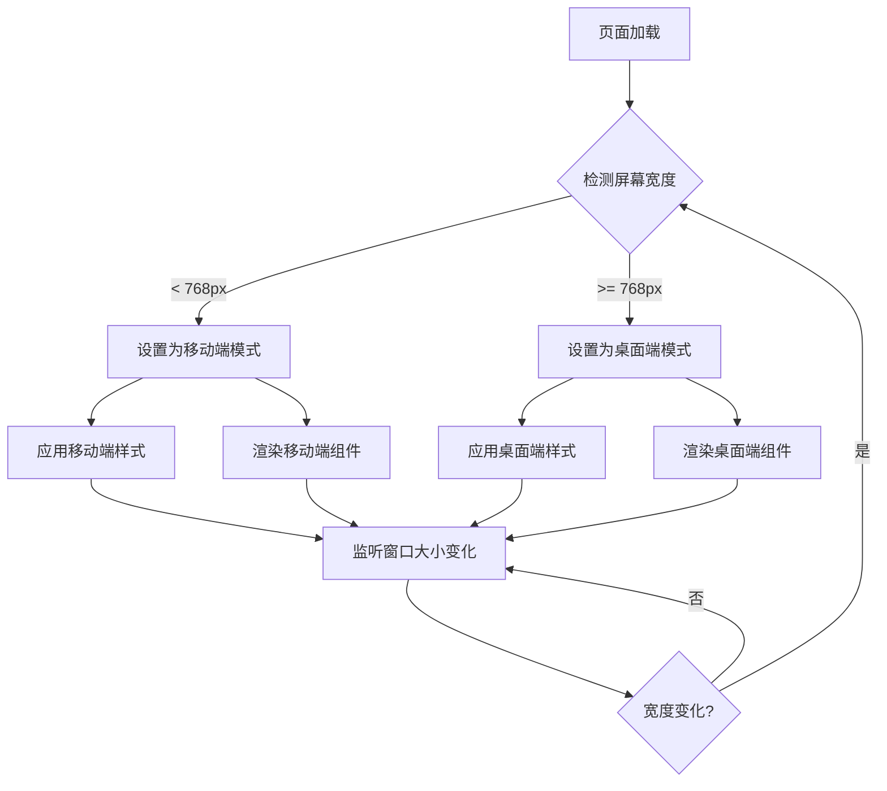
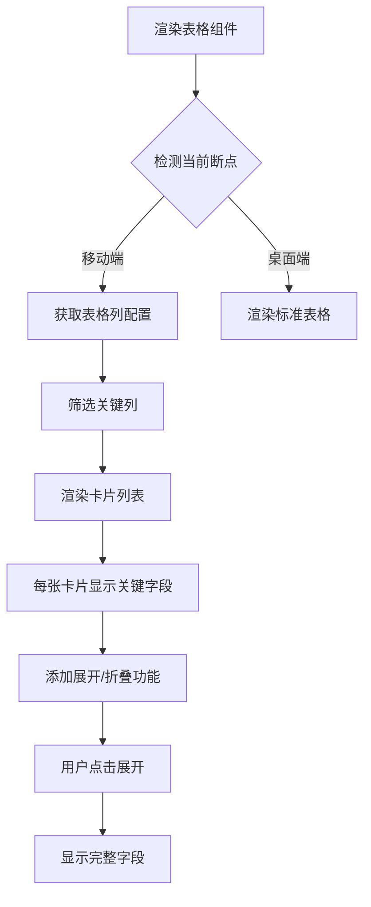

# 移动端适配优化方案 - 技术设计文档

## 1. 系统概要 (System Summary)

本方案采用**移动优先 (Mobile First)** 的响应式设计策略，基于现有 TailwindCSS 框架进行增强。核心思路是通过扩展 Tailwind 配置、创建移动端专用组件、优化现有组件的响应式表现，实现全面的移动端适配。

**技术路线**:
1. **断点系统优化**: 基于现有 Tailwind 断点，增加超小屏幕 (xs: 480px) 支持
2. **组件层改造**: 创建移动端专用组件（MobileTable、BottomSheet、MobileFilter等）
3. **Hooks 增强**: 开发响应式检测 Hooks（useBreakpoint、useMobileDetect）
4. **样式工具**: 提供移动端工具类（safe-area、touch-manipulation 等）
5. **渐进式实施**: 按优先级分阶段改造，确保稳定性

**涉及模块**:
- `tailwind.config.js` - 扩展响应式断点和自定义工具类
- `src/components/mobile/` - 新增移动端专用组件目录
- `src/hooks/` - 新增响应式相关 Hooks
- `src/styles/` - 新增移动端全局样式
- `src/components/theme/` - 改造现有主题组件（Modal、Table、Form 等）

## 2. 决策记录 (Decision Rationale)

### 2.1 技术方案对比

| 方案 | 优点 | 缺点 | 结论 |
|------|------|------|------|
| **A. 独立移动端站点** (m.example.com) | 完全针对移动端优化；加载速度快 | 维护成本高；需要路由分发；SEO 复杂 | ❌ 不适用，项目规模不大 |
| **B. 响应式布局** (当前方案增强) | 一套代码多端适配；维护简单；SEO 友好 | 代码体积略大；需要更多测试 | ✅ **选定方案** |
| **C. 自适应组件库** (如 Ant Design Mobile) | 组件已适配移动端；开发快 | 与现有设计系统冲突；引入新依赖 | ❌ 不适用，与现有 Radix UI 冲突 |

### 2.2 表格适配方案对比

| 方案 | 优点 | 缺点 | 适用场景 |
|------|------|------|----------|
| **横向滚动** | 保留表格结构；实现简单 | 小屏幕体验差；需要横向滚动 | 列数较少 (≤5列) |
| **卡片列表** | 移动端体验好；信息密度适中 | 丢失表格对比性；需要重新设计 | 列数较多 (>5列) |
| **列选择隐藏** | 用户可控；保留表格结构 | 需要额外 UI；配置复杂 | 列数多但用户关注特定列 |

**决策**: 采用**卡片列表为主，横向滚动为辅**的混合策略。任务列表、项目列表使用卡片布局；数据统计表格使用横向滚动。

### 2.3 导航方案对比

| 方案 | 优点 | 缺点 | 结论 |
|------|------|------|------|
| **汉堡菜单** | 节省空间；常见模式 | 多一层操作；隐藏导航 | ❌ 不适用，导航项不多 |
| **底部导航栏** | 单手操作友好；iOS/Android 原生体验 | 占用屏幕空间 | ✅ **选定方案** |
| **顶部横向滚动** | 当前实现；简单 | 可发现性差；项目多时难用 | ⚠️ 保留作为备选 |

**决策**: 保留现有顶部横向滚动导航，同时**增加底部导航栏作为 P0 优先级优化**。

### 2.4 权衡 (Trade-offs)

1. **组件数量增加 vs 代码复用**: 创建移动端专用组件会增加代码量，但能确保最佳体验。通过良好的抽象（如 BaseCard、BaseList）减少重复代码。

2. **功能完整性 vs 性能**: 移动端减少部分非核心功能（如复杂图表交互），优先保证核心流程的流畅性。

3. **开发速度 vs 完美适配**: 采用渐进式实施，P0 优先级功能必须完美适配，P1/P2 可接受轻微瑕疵。

## 3. 详细设计 (Detailed Design)

### 3.1 断点系统设计

```javascript
// tailwind.config.js 扩展
module.exports = {
  theme: {
    extend: {
      screens: {
        'xs': '480px',      // 超小屏幕（大手机）
        // 保留默认断点: sm(640px), md(768px), lg(1024px), xl(1280px), 2xl(1536px)
      },
      spacing: {
        'safe-top': 'env(safe-area-inset-top)',
        'safe-bottom': 'env(safe-area-inset-bottom)',
        'safe-left': 'env(safe-area-inset-left)',
        'safe-right': 'env(safe-area-inset-right)',
        'touch': '44px',    // 最小触摸区域
      },
    },
  },
}
```

### 3.2 逻辑流程 (Logic Flow)

#### 移动端检测流程


#### 表格移动端适配流程


### 3.3 目录与模块结构

```
src/
├── components/
│   ├── mobile/                    # 移动端专用组件
│   │   ├── MobileTable/           # 移动端表格（卡片式）
│   │   │   ├── index.tsx
│   │   │   ├── MobileTableCard.tsx
│   │   │   └── types.ts
│   │   ├── BottomSheet/           # 底部弹出层
│   │   │   ├── index.tsx
│   │   │   └── useBottomSheet.ts
│   │   ├── MobileFilter/          # 移动端筛选抽屉
│   │   │   ├── index.tsx
│   │   │   └── FilterDrawer.tsx
│   │   ├── BottomNav/             # 底部导航栏
│   │   │   ├── index.tsx
│   │   │   └── NavItem.tsx
│   │   ├── TouchButton/           # 触摸优化按钮
│   │   │   └── index.tsx
│   │   └── SafeArea/              # 安全区域容器
│   │       └── index.tsx
│   └── theme/                     # 改造现有组件
│       ├── ThemedTable.tsx        # 添加移动端适配
│       ├── ThemedModal.tsx        # 添加移动端适配
│       └── ThemedForm.tsx         # 添加移动端适配
├── hooks/
│   ├── useBreakpoint.ts           # 断点检测 Hook
│   ├── useMobileDetect.ts         # 移动端检测 Hook
│   ├── useSafeArea.ts             # 安全区域 Hook
│   └── useTouchFeedback.ts        # 触摸反馈 Hook
├── styles/
│   ├── mobile.css                 # 移动端全局样式
│   └── safe-area.css              # 安全区域适配
└── lib/
    └── mobile-utils.ts            # 移动端工具函数
```

### 3.4 数据模型 (Data Models)

```typescript
// src/components/mobile/MobileTable/types.ts

/**
 * 移动端表格列配置
 */
export interface MobileTableColumn<T = any> {
  key: string;
  title: string;
  render?: (record: T) => React.ReactNode;
  priority: 'high' | 'medium' | 'low';  // 显示优先级
  width?: 'full' | 'half' | 'auto';     // 卡片内宽度
}

/**
 * 移动端表格 Props
 */
export interface MobileTableProps<T = any> {
  data: T[];
  columns: MobileTableColumn<T>[];
  keyExtractor: (item: T) => string;
  onRowPress?: (item: T) => void;
  onRowLongPress?: (item: T) => void;
  renderActions?: (item: T) => React.ReactNode;
  expandable?: boolean;
  renderExpanded?: (item: T) => React.ReactNode;
  emptyText?: string;
  loading?: boolean;
}

/**
 * 底部导航项
 */
export interface BottomNavItem {
  key: string;
  label: string;
  icon: React.ComponentType<{ className?: string }>;
  activeIcon?: React.ComponentType<{ className?: string }>;
  badge?: number;
  onPress?: () => void;
}

/**
 * 断点类型
 */
export type Breakpoint = 'xs' | 'sm' | 'md' | 'lg' | 'xl' | '2xl';

/**
 * 设备类型
 */
export type DeviceType = 'mobile' | 'tablet' | 'desktop';
```

### 3.5 交互接口 (APIs / Props)

#### useBreakpoint Hook
```typescript
// src/hooks/useBreakpoint.ts

interface UseBreakpointReturn {
  breakpoint: Breakpoint;
  isMobile: boolean;      // < 768px
  isTablet: boolean;      // 768px - 1024px
  isDesktop: boolean;     // >= 1024px
  isXs: boolean;          // < 480px
  isSm: boolean;          // 480px - 639px
  isMd: boolean;          // 640px - 767px
  isLg: boolean;          // 768px - 1023px
  isXl: boolean;          // 1024px - 1279px
  is2xl: boolean;         // >= 1280px
}

export function useBreakpoint(): UseBreakpointReturn;
```

#### MobileTable 组件
```typescript
// src/components/mobile/MobileTable/index.tsx

interface MobileTableProps<T> {
  data: T[];
  columns: MobileTableColumn<T>[];
  keyExtractor: (item: T) => string;
  onRowPress?: (item: T) => void;
  renderActions?: (item: T) => React.ReactNode;
  expandable?: boolean;
  renderExpanded?: (item: T) => React.ReactNode;
  emptyText?: string;
  loading?: boolean;
  skeletonCount?: number;
}

export function MobileTable<T>(props: MobileTableProps<T>): JSX.Element;
```

#### BottomSheet 组件
```typescript
// src/components/mobile/BottomSheet/index.tsx

interface BottomSheetProps {
  isOpen: boolean;
  onClose: () => void;
  title?: string;
  children: React.ReactNode;
  height?: 'auto' | 'full' | number;  // auto: 自适应, full: 全屏, number: 固定高度(px)
  showHandle?: boolean;
  showCloseButton?: boolean;
  onBackdropPress?: () => void;
  gestureEnabled?: boolean;
}

export function BottomSheet(props: BottomSheetProps): JSX.Element;
```

#### TouchButton 组件
```typescript
// src/components/mobile/TouchButton/index.tsx

interface TouchButtonProps extends React.ButtonHTMLAttributes<HTMLButtonElement> {
  size?: 'sm' | 'md' | 'lg';
  variant?: 'primary' | 'secondary' | 'ghost' | 'danger';
  feedback?: 'scale' | 'opacity' | 'ripple' | 'none';
  minTouchSize?: number;  // 默认 44
  loading?: boolean;
  disabled?: boolean;
}

export function TouchButton(props: TouchButtonProps): JSX.Element;
```

## 4. 安全性与异常处理 (Security & Error Handling)

### 4.1 防御性编程

1. **窗口对象访问安全**
   ```typescript
   // 所有窗口/文档访问需做 SSR 安全判断
   const getWindowWidth = () => {
     if (typeof window === 'undefined') return 1024;
     return window.innerWidth;
   };
   ```

2. **触摸事件处理**
   - 防止触摸事件冲突（如滑动与点击）
   - 处理被动事件监听器的兼容性
   - 防止快速连续点击导致的重复提交

3. **断点检测容错**
   - 默认使用桌面端布局作为 fallback
   - 监听失败时定期轮询检测

### 4.2 性能保护

1. **防抖处理**
   - 窗口 resize 事件使用防抖（debounce 200ms）
   - 滚动事件使用节流（throttle 16ms）

2. **懒加载**
   - 移动端组件使用动态导入（React.lazy）
   - 非首屏组件延迟加载

3. **动画优化**
   - 使用 CSS transform 和 opacity 实现动画（GPU 加速）
   - 移动端减少复杂动画，优先保证流畅度

## 5. 验证方案 (Verification Plan)

### 5.1 自动化测试

1. **响应式断点测试**
   ```typescript
   // 测试不同断点下的组件渲染
   describe('MobileTable', () => {
     it('should render cards on mobile viewport', () => {
       cy.viewport(375, 667);
       cy.mount(<MobileTable data={mockData} columns={mockColumns} />);
       cy.get('[data-testid="mobile-card"]').should('have.length', mockData.length);
     });
   });
   ```

2. **触摸交互测试**
   - 测试触摸区域大小是否符合 44×44px 标准
   - 测试触摸反馈是否正常触发

3. **可访问性测试**
   - 使用 axe-core 进行移动端可访问性扫描
   - 确保触摸目标不重叠

### 5.2 手动验证清单

#### 布局验证
- [ ] 所有页面在 iPhone SE (375×667)、iPhone 14 (390×844)、iPad Mini (768×1024) 模拟器中显示正常
- [ ] 横竖屏切换时布局正确调整
- [ ] 虚拟键盘弹出时输入框保持在可视区域

#### 交互验证
- [ ] 所有按钮触摸区域不小于 44×44px
- [ ] 按钮点击有视觉反馈
- [ ] 弹窗可通过点击遮罩、滑动、点击关闭按钮关闭
- [ ] 长列表可正常滚动，无卡顿

#### 功能验证
- [ ] 任务列表可正常查看、筛选、操作
- [ ] 项目列表可正常查看、筛选、操作
- [ ] 表单可正常填写和提交
- [ ] 仪表盘数据正常显示

#### 兼容性验证
- [ ] iOS Safari 正常
- [ ] Android Chrome 正常
- [ ] 微信内置浏览器正常
- [ ] 企业微信浏览器正常

### 5.3 性能验证

使用 Lighthouse 进行移动端性能测试：
- **Performance 评分**: ≥ 90
- **Accessibility 评分**: ≥ 95
- **Best Practices 评分**: ≥ 90
- **SEO 评分**: ≥ 90
- **First Contentful Paint**: < 1.8s
- **Largest Contentful Paint**: < 2.5s
- **Total Blocking Time**: < 200ms

