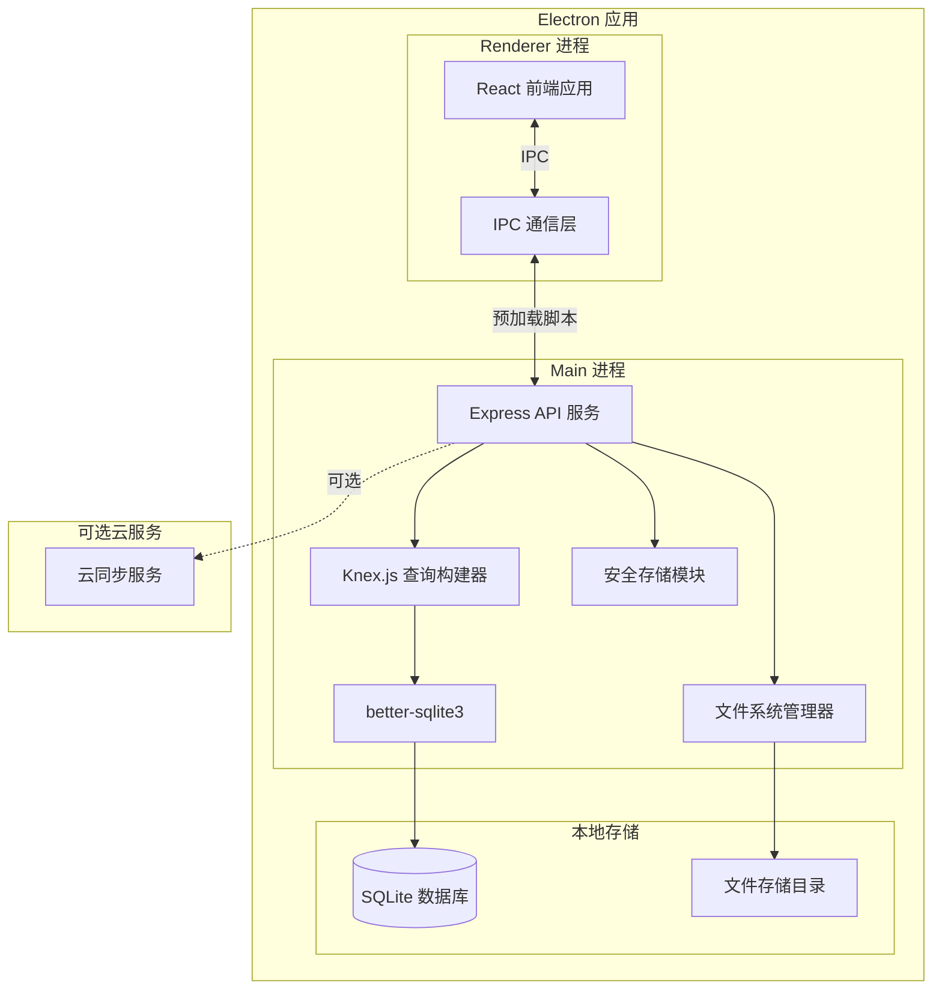
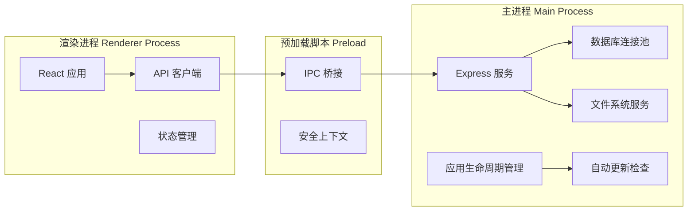
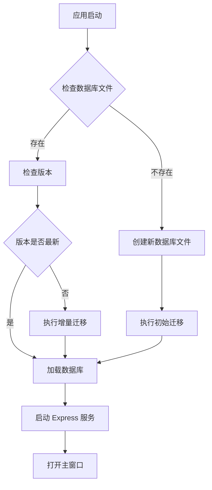
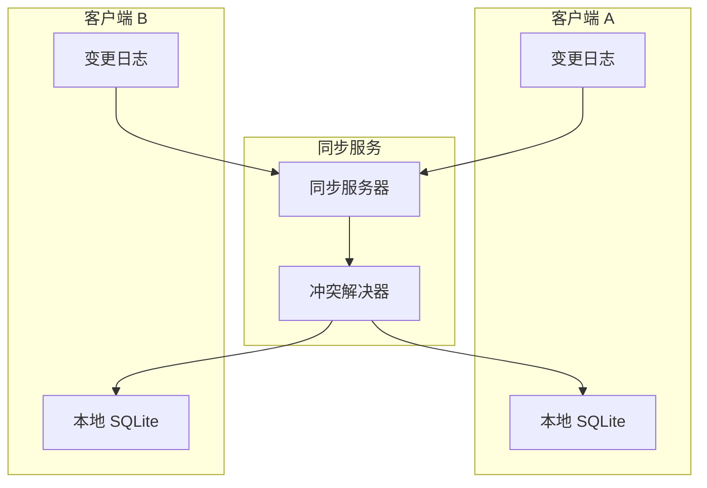

# 离线桌面应用改造项目 - 技术设计文档

## 1. 系统概要 (System Summary)

### 1.1 核心架构

将现有的 Web 应用改造为基于 Electron 的桌面应用，实现前后端一体化打包：

- **前端层**: 保留现有 React + TypeScript 代码，通过 Electron 的 Renderer 进程运行
- **后端层**: 将现有 Express API 改造为 Electron 的 Main 进程内嵌服务
- **数据层**: PostgreSQL → SQLite 迁移，使用 better-sqlite3 驱动
- **文件层**: MinIO → 本地文件系统存储

### 1.2 技术栈选型

| 层级 | 技术选型 | 说明 |
|------|----------|------|
| 桌面框架 | Electron 28+ | 跨平台桌面应用框架 |
| 前端 | React 18 + Vite | 保留现有技术栈 |
| 后端 | Express + Node.js | 内嵌在主进程中 |
| 数据库 | SQLite 3.44+ | 轻量级本地数据库 |
| 数据库驱动 | better-sqlite3 | 高性能同步 SQLite 驱动 |
| ORM/查询 | Knex.js | 保留现有查询构建器 |
| 文件存储 | Node.js fs API | 本地文件系统 |
| 打包工具 | electron-builder | 应用打包和分发 |
| 更新机制 | electron-updater | 自动更新支持 |

### 1.3 整体架构图



## 2. 决策记录 (Decision Rationale)

### 2.1 方案对比

| 方案 | 优点 | 缺点 | 结论 |
|------|------|------|------|
| **Electron** | 成熟稳定、生态丰富、可复用现有代码 | 包体积较大 | ✅ 选用 |
| Tauri | 包体积小、Rust 性能高 | 需重写后端、学习成本高 | ❌ 不适用 |
| PWA + IndexedDB | 无需打包、自动更新 | 功能受限、存储容量有限 | ❌ 不满足需求 |
| Flutter Desktop | UI 性能好 | 需重写全部代码 | ❌ 成本过高 |

### 2.2 数据库选型

| 方案 | 优点 | 缺点 | 结论 |
|------|------|------|------|
| **SQLite** | 零配置、单文件、性能优秀 | 并发写入受限 | ✅ 选用 |
| IndexedDB | 浏览器原生支持 | 查询能力弱、大数据性能差 | ❌ 不适用 |
| PouchDB | 支持同步 | 查询能力有限 | ❌ 不适用 |
| DuckDB | 分析性能强 | 写入性能一般 | ❌ 不适用 |

### 2.3 权衡 (Trade-offs)

1. **包体积 vs 开发效率**: 选择 Electron 带来约 150MB 的基础包体积，但可最大化复用现有代码
2. **SQLite vs PostgreSQL**: 牺牲部分高级 SQL 特性，换取零配置部署
3. **同步 vs 异步**: 使用 better-sqlite3 的同步 API，简化代码但需注意阻塞主线程

## 3. 详细设计 (Detailed Design)

### 3.1 进程架构设计



### 3.2 目录结构

```
desktop/
├── electron/
│   ├── main/
│   │   ├── index.ts              # 主进程入口
│   │   ├── app.ts                # 应用生命周期
│   │   ├── server.ts             # Express 服务
│   │   ├── database.ts           # 数据库管理
│   │   └── ipc-handlers.ts       # IPC 处理器
│   ├── preload/
│   │   └── index.ts              # 预加载脚本
│   └── renderer/
│       └── index.html            # 渲染进程入口
├── src/
│   ├── main/                     # 主进程源码
│   │   ├── api/                  # API 路由适配
│   │   ├── services/             # 业务服务
│   │   ├── database/             # 数据库相关
│   │   │   ├── connection.ts     # 连接管理
│   │   │   ├── migrations/       # 迁移脚本
│   │   │   └── seeds/            # 种子数据
│   │   └── utils/                # 工具函数
│   └── renderer/                 # 渲染进程源码（复用现有 src）
├── resources/
│   ├── icon.icns                 # macOS 图标
│   ├── icon.ico                  # Windows 图标
│   └── icon.png                  # Linux 图标
├── build/
│   └── electron-builder.yml      # 打包配置
├── package.json
└── vite.config.ts
```

### 3.3 数据库迁移方案

#### PostgreSQL → SQLite 类型映射

| PostgreSQL | SQLite | 说明 |
|------------|--------|------|
| UUID | TEXT | SQLite 无原生 UUID |
| TIMESTAMPTZ | INTEGER | 存储 Unix 时间戳（毫秒） |
| JSONB | TEXT | 存储 JSON 字符串 |
| BOOLEAN | INTEGER | 0/1 表示 |
| TEXT | TEXT | 保持一致 |
| INTEGER | INTEGER | 保持一致 |
| DECIMAL | REAL | 浮点数存储 |

#### 数据库初始化流程



### 3.4 API 适配层设计

#### 现有 API 调用方式

```typescript
// 原 Web 版本
const { data } = await api.db
  .from('projects')
  .select('*')
  .eq('status', 'active');
```

#### 桌面版适配方案

```typescript
// 桌面版 - 通过 IPC 调用主进程 API
const { data } = await window.electronAPI.dbQuery({
  table: 'projects',
  action: 'select',
  fields: ['*'],
  filters: { status: 'active' }
});
```

#### Knex.js 适配器实现

```typescript
// src/main/database/knex-adapter.ts
import Database from 'better-sqlite3';
import knex from 'knex';

export const createKnexInstance = (dbPath: string) => {
  return knex({
    client: 'better-sqlite3',
    connection: { filename: dbPath },
    useNullAsDefault: true,
    pool: {
      min: 1,
      max: 1  // SQLite 单连接
    }
  });
};
```

### 3.5 文件存储方案

#### 存储路径设计

| 平台 | 数据目录路径 |
|------|-------------|
| Windows | `%APPDATA%/PMSY/data/` |
| macOS | `~/Library/Application Support/PMSY/data/` |
| Linux | `~/.config/PMSY/data/` |

#### 文件管理实现

```typescript
// src/main/services/fileStorage.ts
import { app } from 'electron';
import path from 'path';
import fs from 'fs-extra';

export class FileStorageService {
  private basePath: string;
  
  constructor() {
    this.basePath = path.join(app.getPath('userData'), 'files');
    fs.ensureDirSync(this.basePath);
  }
  
  async saveFile(fileName: string, buffer: Buffer): Promise<string> {
    const filePath = path.join(this.basePath, fileName);
    await fs.writeFile(filePath, buffer);
    return filePath;
  }
  
  async getFile(fileName: string): Promise<Buffer> {
    const filePath = path.join(this.basePath, fileName);
    return fs.readFile(filePath);
  }
  
  async deleteFile(fileName: string): Promise<void> {
    const filePath = path.join(this.basePath, fileName);
    await fs.remove(filePath);
  }
}
```

### 3.6 数据模型 (TypeScript)

#### 数据库配置

```typescript
// src/main/types/database.ts
export interface DatabaseConfig {
  path: string;
  version: number;
  encryption?: {
    enabled: boolean;
    key?: string;
  };
  backup: {
    enabled: boolean;
    interval: number; // 小时
    maxBackups: number;
  };
}
```

#### IPC 通信接口

```typescript
// src/main/types/ipc.ts
export interface IpcChannels {
  // 数据库操作
  'db:query': (params: DbQueryParams) => Promise<DbQueryResult>;
  'db:transaction': (operations: DbOperation[]) => Promise<void>;
  
  // 文件操作
  'file:save': (params: SaveFileParams) => Promise<string>;
  'file:read': (fileId: string) => Promise<Buffer>;
  'file:delete': (fileId: string) => Promise<void>;
  
  // 应用操作
  'app:getVersion': () => string;
  'app:checkUpdate': () => Promise<UpdateInfo>;
  'app:backup': () => Promise<string>;
  'app:restore': (backupPath: string) => Promise<void>;
}
```

### 3.7 安全设计

#### 数据库加密

```typescript
// 使用 SQLCipher 扩展 SQLite 加密
import Database from 'better-sqlite3';

const db = new Database(dbPath);
db.exec(`PRAGMA key = '${encryptionKey}'`);
```

#### 安全存储敏感信息

```typescript
// 使用 Electron safeStorage 加密存储密码
import { safeStorage } from 'electron';

const encrypted = safeStorage.encryptString(password);
const decrypted = safeStorage.decryptString(encrypted);
```

#### CSP 策略

```html
<meta http-equiv="Content-Security-Policy" 
      content="default-src 'self'; 
               script-src 'self';
               style-src 'self' 'unsafe-inline';
               img-src 'self' data: blob:;
               font-src 'self';
               connect-src 'self';">
```

## 4. 打包与分发方案

### 4.1 electron-builder 配置

```yaml
# build/electron-builder.yml
appId: com.pmsy.desktop
productName: PMSY
directories:
  output: dist
  buildResources: resources
files:
  - "out/**/*"
  - "resources/**/*"
mac:
  category: public.app-category.business
  target:
    - dmg
    - zip
win:
  target:
    - nsis
    - portable
linux:
  target:
    - AppImage
    - deb
nsis:
  oneClick: false
  allowToChangeInstallationDirectory: true
```

### 4.2 构建流程


## 5. 数据同步方案（可选）

### 5.1 同步架构



### 5.2 冲突解决策略

- **Last Write Wins**: 以时间戳为准，最后写入的覆盖
- **Merge**: 对可合并字段（如 JSON）进行合并
- **Manual**: 标记冲突，由用户手动解决

## 6. 性能优化方案

### 6.1 数据库优化

- **索引**: 保留原 PostgreSQL 的所有索引
- **分页**: 所有列表查询强制分页（默认 20 条/页）
- **连接池**: SQLite 单连接，使用队列管理并发
- **预编译**: 使用 prepared statement 缓存

### 6.2 前端优化

- **代码分割**: 按路由懒加载
- **虚拟滚动**: 大数据列表使用虚拟滚动
- **本地缓存**: 使用 IndexedDB 缓存静态资源

### 6.3 启动优化

- **Splash Screen**: 显示启动画面，后台初始化数据库
- **延迟加载**: 非核心模块延迟加载
- **预加载**: 预加载常用页面

## 7. 硬件配置要求

| 配置项 | 最低要求 | 推荐配置 |
|--------|----------|----------|
| CPU | 双核 1.6GHz | 四核 2.0GHz+ |
| 内存 | 4GB | 8GB+ |
| 磁盘 | 1GB 可用空间 | 10GB+ SSD |
| 操作系统 | Windows 10 / macOS 11 / Ubuntu 20.04 | 最新版本 |

## 8. 安全性与异常处理

### 8.1 异常处理策略

| 异常类型 | 处理方式 |
|----------|----------|
| 数据库损坏 | 自动检测，提示恢复备份 |
| 磁盘空间不足 | 预警提示，暂停写入操作 |
| 文件权限错误 | 引导用户授权，或更换存储路径 |
| 内存不足 | 清理缓存，提示关闭其他应用 |

### 8.2 数据备份策略

- **自动备份**: 每日自动备份到指定目录
- **手动备份**: 支持一键导出加密备份文件
- **版本保留**: 保留最近 30 个备份版本

## 9. 验证方案

### 9.1 测试策略

- **单元测试**: 数据库操作、业务逻辑
- **集成测试**: API 接口、IPC 通信
- **E2E 测试**: 完整业务流程
- **跨平台测试**: Windows/macOS/Linux 兼容性

### 9.2 性能测试

- 启动时间测试
- 大数据量查询性能
- 文件上传下载速度
- 内存占用监控
