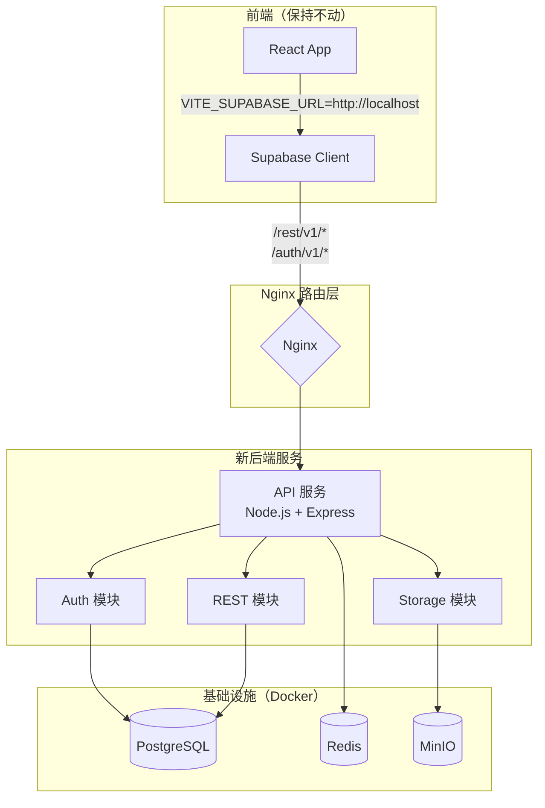
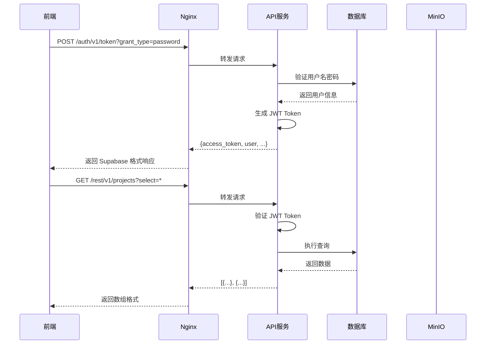

# PMSY 移除 Supabase 依赖技术设计文档

## 1. 系统概要 (System Summary)

本设计将 PMSY 项目从 Supabase 云服务迁移到自托管架构。核心思路是**保持前端代码零改动**，通过在后端 API 层实现 Supabase 兼容接口来完成迁移。

**技术路线：**
- 使用 **PostgreSQL** 替代 Supabase Database
- 使用 **JWT + bcrypt** 替代 Supabase Auth
- 使用 **MinIO** 替代 Supabase Storage
- 使用 **Redis** 管理会话和缓存
- 使用 **Knex.js** 作为数据库查询构建器
- 使用 **Socket.io** 替代 Supabase Realtime（可选）

**集成方式：**
- 新建 `api-new/` 目录存放新后端代码
- Nginx 将 `/rest/v1/*` 和 `/auth/v1/*` 路由到新 API 服务
- 前端 `VITE_SUPABASE_URL` 指向本地 API 服务
- 逐步迁移，旧代码保持运行直到完全替换

## 2. 决策记录 (Decision Rationale)

### 2.1 原方案选择

| 方案 | 优点 | 缺点 | 结论 |
|------|------|------|------|
| **A. 完全重写前端** | 架构最清晰 | 工作量大（2-3个月），风险高 | ❌ 放弃 |
| **B. 保留本地 Supabase** | 改动最小 | 部署复杂，维护困难 | ❌ 放弃 |
| **C. API 层封装（选中）** | 前端零改动，渐进式迁移 | 需要维护兼容层 | ✅ 采用 |

**选择方案 C 的原因：**
1. **风险控制**：前端 100+ 处数据库调用不需要修改，降低引入 Bug 的风险
2. **时间成本**：预计 2-3 周完成，而非 2-3 个月
3. **业务连续性**：可以逐步迁移，不影响线上业务
4. **团队适应**：后端团队可以逐步熟悉新架构

### 2.2 权衡 (Trade-offs)

- **牺牲部分性能**：API 兼容层会增加一层转发，但影响可接受（< 10ms）
- **维护兼容层成本**：需要维护与 Supabase 格式兼容的代码，但封装后影响范围小
- **放弃 Supabase 高级功能**：如 Edge Functions、RLS 策略等需要自行实现

## 3. 详细设计 (Detailed Design)

### 3.1 架构图



### 3.2 请求流程



### 3.3 目录与模块结构

```
api-new/
├── src/
│   ├── config/
│   │   ├── database.ts          # 数据库连接配置
│   │   ├── redis.ts             # Redis 连接配置
│   │   ├── minio.ts             # MinIO 连接配置
│   │   └── constants.ts         # 常量定义
│   ├── middleware/
│   │   ├── auth.ts              # JWT 验证中间件
│   │   ├── errorHandler.ts      # 错误处理中间件
│   │   └── requestValidator.ts  # 请求验证中间件
│   ├── routes/
│   │   ├── auth.ts              # Auth API 路由 (/auth/v1/*)
│   │   ├── rest.ts              # REST API 路由 (/rest/v1/*)
│   │   ├── storage.ts           # Storage API 路由 (/storage/v1/*)
│   │   └── health.ts            # 健康检查路由
│   ├── services/
│   │   ├── authService.ts       # 认证业务逻辑
│   │   ├── dbService.ts         # 数据库操作封装
│   │   ├── storageService.ts    # 文件存储业务逻辑
│   │   └── jwtService.ts        # JWT 生成和验证
│   ├── utils/
│   │   ├── supabaseCompat.ts    # Supabase 格式兼容工具
│   │   ├── password.ts          # 密码加密工具
│   │   └── logger.ts            # 日志工具
│   ├── types/
│   │   ├── auth.ts              # 认证相关类型
│   │   ├── database.ts          # 数据库相关类型
│   │   └── index.ts             # 类型导出
│   └── index.ts                 # 服务入口
├── database/
│   ├── migrations/
│   │   ├── 001_create_profiles.sql
│   │   ├── 002_create_projects.sql
│   │   └── ...                  # 其他表结构
│   └── seeds/
│       └── init_data.sql        # 初始数据
├── docker-compose.yml           # 开发环境配置
├── Dockerfile                   # API 服务镜像
├── package.json
└── tsconfig.json
```

### 3.4 数据模型

#### 3.4.1 用户表（替代 auth.users）

```typescript
// types/auth.ts
export interface Profile {
  id: string;                    // UUID
  email: string;                 // 唯一
  username: string;              // 唯一，用于登录
  password_hash: string;         // bcrypt 加密
  full_name: string;
  avatar_url?: string;
  role: 'admin' | 'user' | 'manager';
  is_active: boolean;
  email_confirmed_at?: Date;
  created_at: Date;
  updated_at: Date;
  last_sign_in_at?: Date;
}

// 登录响应格式（兼容 Supabase）
export interface AuthResponse {
  user: {
    id: string;
    email: string;
    user_metadata: {
      full_name: string;
      role: string;
    };
    created_at: string;
  };
  session: {
    access_token: string;
    token_type: 'bearer';
    expires_in: number;
    expires_at: number;
    refresh_token: string;
  };
}
```

#### 3.4.2 JWT Token 格式

```typescript
// services/jwtService.ts
export interface JWTPayload {
  sub: string;           // 用户 ID
  email: string;
  role: string;
  iat: number;           // 签发时间
  exp: number;           // 过期时间
}

// Token 生成配置
const JWT_CONFIG = {
  secret: process.env.JWT_SECRET!,
  expiresIn: '7d',       // 7 天
  issuer: 'pmsy-api',
  audience: 'pmsy-client'
};
```

### 3.5 交互接口 (APIs)

#### 3.5.1 Auth API（兼容 Supabase Auth）

| 端点 | 方法 | 说明 | 输入 | 输出 |
|------|------|------|------|------|
| `/auth/v1/token?grant_type=password` | POST | 密码登录 | `{email, password}` | AuthResponse |
| `/auth/v1/signup` | POST | 用户注册 | `{email, password, full_name}` | AuthResponse |
| `/auth/v1/logout` | POST | 退出登录 | Header: Authorization | `{success: true}` |
| `/auth/v1/user` | GET | 获取当前用户 | Header: Authorization | User |
| `/auth/v1/user` | PUT | 更新用户信息 | Header: Authorization + 更新字段 | User |
| `/auth/v1/admin/users` | GET | 列出所有用户（管理员） | Header: Authorization | User[] |
| `/auth/v1/admin/users/:id` | PUT | 更新用户（管理员） | Header: Authorization + 更新字段 | User |

#### 3.5.2 REST API（兼容 Supabase PostgREST）

| 端点 | 方法 | 说明 | 查询参数 |
|------|------|------|----------|
| `/rest/v1/:table` | GET | 查询数据 | `select`, `eq`, `order`, `limit`, `offset` |
| `/rest/v1/:table` | POST | 插入数据 | - |
| `/rest/v1/:table` | PATCH | 更新数据 | `eq` |
| `/rest/v1/:table` | DELETE | 删除数据 | `eq` |

**查询参数示例：**
```
GET /rest/v1/projects?select=id,name,status&eq=status,active&order=created_at.desc&limit=10
```

#### 3.5.3 Storage API（兼容 Supabase Storage）

| 端点 | 方法 | 说明 |
|------|------|------|
| `/storage/v1/object/:bucket/:path` | POST | 上传文件 |
| `/storage/v1/object/:bucket/:path` | GET | 下载文件 |
| `/storage/v1/object/:bucket/:path` | DELETE | 删除文件 |
| `/storage/v1/object/public/:bucket/:path` | GET | 获取公开 URL |

### 3.6 数据库 Schema

```sql
-- 核心用户表（替代 auth.users）
CREATE TABLE profiles (
    id UUID PRIMARY KEY DEFAULT gen_random_uuid(),
    email TEXT UNIQUE NOT NULL,
    username TEXT UNIQUE NOT NULL,
    password_hash TEXT NOT NULL,
    full_name TEXT NOT NULL,
    avatar_url TEXT,
    role TEXT DEFAULT 'user' CHECK (role IN ('admin', 'user', 'manager')),
    is_active BOOLEAN DEFAULT true,
    email_confirmed_at TIMESTAMPTZ,
    created_at TIMESTAMPTZ DEFAULT NOW(),
    updated_at TIMESTAMPTZ DEFAULT NOW(),
    last_sign_in_at TIMESTAMPTZ
);

-- 业务表结构保持与原 Supabase 一致
-- projects, tasks, project_members, files, folders, notifications 等
-- （从现有 migrations 复制）

-- 索引
CREATE INDEX idx_profiles_email ON profiles(email);
CREATE INDEX idx_profiles_username ON profiles(username);
CREATE INDEX idx_profiles_role ON profiles(role);
```

## 4. 安全性与异常处理

### 4.1 防御性编程

```typescript
// middleware/errorHandler.ts
export const errorHandler = (err: Error, req: Request, res: Response, next: NextFunction) => {
  console.error('Error:', err);

  // 数据库错误
  if (err.code === '23505') {  // 唯一约束冲突
    return res.status(409).json({
      code: 'DUPLICATE_ENTRY',
      message: '数据已存在'
    });
  }

  // JWT 错误
  if (err.name === 'JsonWebTokenError') {
    return res.status(401).json({
      code: 'INVALID_TOKEN',
      message: '无效的认证令牌'
    });
  }

  // 默认错误
  res.status(500).json({
    code: 'INTERNAL_ERROR',
    message: process.env.NODE_ENV === 'production' 
      ? '服务器内部错误' 
      : err.message
  });
};
```

### 4.2 权限校验

```typescript
// middleware/auth.ts
export const requireAuth = async (req: Request, res: Response, next: NextFunction) => {
  const token = req.headers.authorization?.replace('Bearer ', '');
  
  if (!token) {
    return res.status(401).json({ message: '未提供认证令牌' });
  }

  try {
    const payload = jwtService.verify(token);
    req.user = payload;
    next();
  } catch (error) {
    return res.status(401).json({ message: '认证令牌无效或已过期' });
  }
};

export const requireRole = (roles: string[]) => {
  return (req: Request, res: Response, next: NextFunction) => {
    if (!roles.includes(req.user.role)) {
      return res.status(403).json({ message: '权限不足' });
    }
    next();
  };
};
```

### 4.3 RLS 策略替代方案

在应用层实现行级安全控制：

```typescript
// services/dbService.ts
export class DatabaseService {
  // 自动添加用户权限过滤
  async queryWithRLS(table: string, userId: string, userRole: string, query: any) {
    let builder = knex(table);

    // 管理员可以查看所有数据
    if (userRole !== 'admin') {
      // 根据表添加不同的权限过滤
      switch (table) {
        case 'projects':
          builder = builder.whereExists(function() {
            this.select('*')
              .from('project_members')
              .whereRaw('project_members.project_id = projects.id')
              .where('user_id', userId);
          });
          break;
        case 'tasks':
          builder = builder.where('assignee_id', userId)
            .orWhere('creator_id', userId);
          break;
        // 其他表的权限控制...
      }
    }

    return await builder;
  }
}
```

## 5. 验证方案

### 5.1 自动化测试

```typescript
// tests/auth.test.ts
describe('Auth API', () => {
  it('should login with valid credentials', async () => {
    const res = await request(app)
      .post('/auth/v1/token?grant_type=password')
      .send({ email: 'test@example.com', password: 'password123' });
    
    expect(res.status).toBe(200);
    expect(res.body).toHaveProperty('access_token');
    expect(res.body.user).toHaveProperty('email');
  });

  it('should return 401 with invalid credentials', async () => {
    const res = await request(app)
      .post('/auth/v1/token?grant_type=password')
      .send({ email: 'test@example.com', password: 'wrong' });
    
    expect(res.status).toBe(401);
  });
});

// tests/rest.test.ts
describe('REST API', () => {
  it('should query projects with select parameter', async () => {
    const res = await request(app)
      .get('/rest/v1/projects?select=id,name,status')
      .set('Authorization', `Bearer ${token}`);
    
    expect(res.status).toBe(200);
    expect(Array.isArray(res.body)).toBe(true);
    expect(res.body[0]).toHaveProperty('id');
    expect(res.body[0]).toHaveProperty('name');
  });
});
```

### 5.2 手动验证清单

1. **启动开发环境**
   ```bash
   cd api-new
   docker-compose up -d
   ```

2. **验证数据库连接**
   ```bash
   curl http://localhost:3001/health
   # 期望: {"status": "ok", "database": "connected"}
   ```

3. **测试用户注册和登录**
   ```bash
   # 注册
   curl -X POST http://localhost:3001/auth/v1/signup \
     -H "Content-Type: application/json" \
     -d '{"email":"test@test.com","password":"test123","full_name":"Test User"}'

   # 登录
   curl -X POST "http://localhost:3001/auth/v1/token?grant_type=password" \
     -H "Content-Type: application/json" \
     -d '{"email":"test@test.com","password":"test123"}'
   ```

4. **测试数据查询**
   ```bash
   curl http://localhost:3001/rest/v1/projects?select=* \
     -H "Authorization: Bearer <token>"
   ```

5. **测试文件上传**
   ```bash
   curl -X POST http://localhost:3001/storage/v1/object/files/test.txt \
     -H "Authorization: Bearer <token>" \
     -F "file=@/path/to/local/file.txt"
   ```

6. **前端集成测试**
   - 修改前端 `.env` 文件中的 `VITE_SUPABASE_URL` 为 `http://localhost`
   - 运行前端应用，验证登录、数据查询、文件上传等功能正常

## 6. 部署架构

### 6.1 开发环境（本地 Docker）

```yaml
# api-new/docker-compose.yml
version: '3.8'

services:
  postgres:
    image: postgres:15-alpine
    environment:
      POSTGRES_USER: pmsy
      POSTGRES_PASSWORD: pmsy_dev_password
      POSTGRES_DB: pmsy_dev
    volumes:
      - postgres_data:/var/lib/postgresql/data
      - ./database/migrations:/docker-entrypoint-initdb.d
    ports:
      - "5432:5432"

  redis:
    image: redis:7-alpine
    ports:
      - "6379:6379"

  minio:
    image: minio/minio:latest
    command: server /data --console-address ":9001"
    environment:
      MINIO_ROOT_USER: minioadmin
      MINIO_ROOT_PASSWORD: minioadmin
    volumes:
      - minio_data:/data
    ports:
      - "9000:9000"
      - "9001:9001"

  api:
    build: .
    environment:
      - NODE_ENV=development
      - DB_HOST=postgres
      - DB_USER=pmsy
      - DB_PASSWORD=pmsy_dev_password
      - DB_NAME=pmsy_dev
      - REDIS_URL=redis://redis:6379
      - MINIO_ENDPOINT=minio:9000
      - MINIO_ACCESS_KEY=minioadmin
      - MINIO_SECRET_KEY=minioadmin
      - JWT_SECRET=dev_jwt_secret_key_change_in_production
    ports:
      - "3001:3001"
    volumes:
      - ./src:/app/src
    depends_on:
      - postgres
      - redis
      - minio

volumes:
  postgres_data:
  minio_data:
```

### 6.2 生产环境

生产环境使用相同的 Docker 配置，但：
- 使用更强的密码和 JWT Secret
- 启用 PostgreSQL SSL 连接
- 配置 MinIO 分布式存储
- 使用 Nginx 反向代理和负载均衡
- 配置自动备份

## 7. 迁移计划

### 阶段 1：搭建新后端（第 1 周）
- [ ] 创建 api-new 项目结构
- [ ] 实现 Auth API（登录、注册、Token 验证）
- [ ] 实现基础 REST API（查询、插入、更新、删除）
- [ ] 配置本地 Docker 开发环境

### 阶段 2：完善功能（第 2 周）
- [ ] 实现 Storage API（文件上传、下载）
- [ ] 实现复杂查询支持（关联查询、聚合）
- [ ] 添加权限控制（RLS 替代方案）
- [ ] 编写数据迁移脚本

### 阶段 3：测试验证（第 3 周）
- [ ] 单元测试和集成测试
- [ ] 前端集成测试
- [ ] 性能测试和优化
- [ ] 数据迁移验证

### 阶段 4：上线切换（第 4 周）
- [ ] 生产环境部署
- [ ] 数据迁移
- [ ] 切换 DNS/路由
- [ ] 监控和回滚方案
