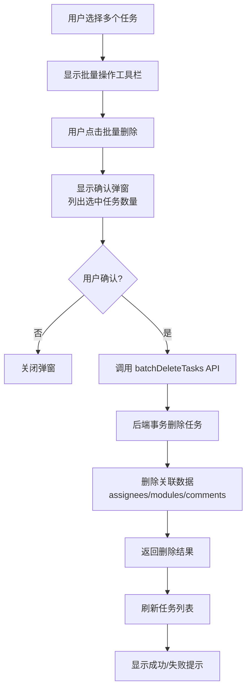
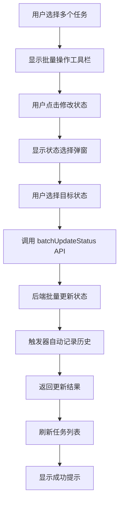
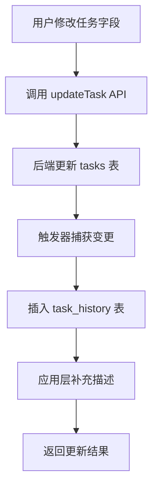

# 任务中心功能完善技术设计文档

## 1. 系统概要 (System Summary)

本次功能完善分为两大模块：

1. **批量操作模块**：在任务列表页面增加多选后的批量操作能力，包括批量删除、批量修改状态、批量分配处理人。通过新增批量操作工具栏和对应弹窗组件实现。

2. **任务历史记录模块**：新增任务历史记录表，记录任务的所有字段变更。在任务详情页增加优先级和截止日期的编辑能力，并在历史Tab中展示完整的变更记录。

核心改动涉及：
- 前端：新增 5 个组件，修改 3 个现有页面
- 后端：新增 1 个数据库表，新增 4 个 API 接口
- 服务层：扩展 taskService 增加批量操作和历史记录接口

---

## 2. 决策记录 (Decision Rationale)

### 2.1 原方案选择

**批量操作实现方案对比：**

| 方案 | 说明 | 优缺点 |
|------|------|--------|
| A. 前端循环调用单条API | 前端遍历选中任务，逐个调用删除/更新接口 | 实现简单，但请求过多，性能差 |
| B. 后端提供批量API | 后端提供专门的批量操作接口，事务处理 | 性能好，事务保证一致性，**选中** |
| C. 混合方案 | 少量任务用方案A，大量任务用方案B | 复杂度高，收益不明显 |

**选择方案B**，理由：
- 批量操作通常涉及多个任务，需要保证原子性
- 减少网络请求次数，提升用户体验
- 便于统一权限校验和错误处理

**历史记录实现方案对比：**

| 方案 | 说明 | 优缺点 |
|------|------|--------|
| A. 应用层记录 | 在API中手动插入历史记录 | 灵活，但容易遗漏，代码侵入性强 |
| B. 数据库触发器 | 使用 PostgreSQL 触发器自动记录 | 自动可靠，但不够灵活，**选中** |
| C. 混合方案 | 触发器记录基础变更，应用层补充描述 | 兼顾自动化和灵活性 |

**选择方案B为主，C为辅**，理由：
- 使用触发器保证所有变更都被记录，不会遗漏
- 应用层负责生成友好的变更描述
- 减少业务代码侵入，维护更简单

### 2.2 权衡 (Trade-offs)

1. **历史记录粒度**：记录字段级变更而非整行快照
   - 优点：存储空间小，变更对比清晰
   - 缺点：无法直接查看历史完整状态

2. **批量操作权限**：统一使用创建者权限校验
   - 优点：逻辑简单，与现有权限体系一致
   - 缺点：暂不支持更细粒度的权限控制

3. **历史记录展示**：先实现基础列表，暂不做分页
   - 优点：开发速度快，满足基本需求
   - 缺点：任务历史过多时可能影响性能（后续可优化）

---

## 3. 详细设计 (Detailed Design)

### 3.1 逻辑流程 (Logic Flow)

#### 批量删除任务流程



#### 批量修改状态流程



#### 任务字段变更记录流程



### 3.2 目录与模块结构 (Structure)

```
src/
├── pages/
│   └── tasks/
│       ├── TaskList.tsx                    # 修改：集成批量操作工具栏
│       ├── TaskDetailPage.tsx              # 修改：添加优先级/截止日期编辑
│       └── components/
│           ├── TaskTable.tsx               # 现有：多选功能
│           ├── BatchActionBar.tsx          # 新增：批量操作工具栏
│           ├── BatchDeleteModal.tsx        # 新增：批量删除确认弹窗
│           ├── BatchStatusModal.tsx        # 新增：批量修改状态弹窗
│           ├── BatchAssignModal.tsx        # 新增：批量分配处理人弹窗
│           └── TaskHistory.tsx             # 新增：任务历史记录组件
├── services/
│   └── taskService.ts                      # 修改：添加批量操作和历史接口
└── types/
    └── task.ts                             # 修改：添加历史记录类型

api-new/
├── database/
│   └── migrations/
│       └── 005_add_task_history.sql        # 新增：历史记录表迁移
└── src/
    └── routes/
        └── tasks.ts                        # 修改：添加批量操作和历史API
```

### 3.3 数据模型 (Data Models)

#### 新增类型定义

```typescript
// src/types/task.ts

/**
 * 任务历史记录
 */
export interface TaskHistory {
  id: string;
  task_id: string;
  user_id: string;
  field_name: string;           // 变更字段: title/status/priority/due_date/assignees等
  old_value: string | null;     // 变更前值
  new_value: string | null;     // 变更后值
  change_type: 'create' | 'update' | 'delete';
  description: string;          // 友好描述: "将优先级从'中'修改为'高'"
  created_at: string;
  creator?: {
    id: string;
    full_name: string;
    avatar_url?: string;
  };
}

/**
 * 批量操作请求
 */
export interface BatchDeleteRequest {
  task_ids: string[];
}

export interface BatchUpdateStatusRequest {
  task_ids: string[];
  status: TaskStatus;
}

export interface BatchAssignRequest {
  task_ids: string[];
  user_ids: string[];           // 要添加的处理人ID列表
  mode: 'append' | 'replace';   // append: 追加, replace: 替换
}
```

#### 数据库表结构

```sql
-- 任务历史记录表
CREATE TABLE IF NOT EXISTS task_history (
    id UUID PRIMARY KEY DEFAULT gen_random_uuid(),
    task_id UUID REFERENCES tasks(id) ON DELETE CASCADE NOT NULL,
    user_id UUID REFERENCES profiles(id) ON DELETE SET NULL,
    field_name TEXT NOT NULL,           -- 变更字段名
    old_value TEXT,                      -- 变更前值
    new_value TEXT,                      -- 变更后值
    change_type TEXT NOT NULL CHECK (change_type IN ('create', 'update', 'delete')),
    description TEXT,                    -- 变更描述
    created_at TIMESTAMPTZ DEFAULT NOW() NOT NULL
);

-- 索引
CREATE INDEX IF NOT EXISTS idx_task_history_task_id ON task_history(task_id);
CREATE INDEX IF NOT EXISTS idx_task_history_created_at ON task_history(created_at);

-- 触发器函数：记录任务变更历史
CREATE OR REPLACE FUNCTION record_task_history()
RETURNS TRIGGER AS $$
BEGIN
    IF TG_OP = 'UPDATE' THEN
        -- 记录每个字段的变更
        IF OLD.title IS DISTINCT FROM NEW.title THEN
            INSERT INTO task_history (task_id, user_id, field_name, old_value, new_value, change_type, description)
            VALUES (NEW.id, current_setting('app.current_user_id')::UUID, 'title', OLD.title, NEW.title, 'update', 
                    '修改标题: ' || COALESCE(OLD.title, '空') || ' → ' || COALESCE(NEW.title, '空'));
        END IF;
        
        IF OLD.status IS DISTINCT FROM NEW.status THEN
            INSERT INTO task_history (task_id, user_id, field_name, old_value, new_value, change_type, description)
            VALUES (NEW.id, current_setting('app.current_user_id')::UUID, 'status', OLD.status, NEW.status, 'update',
                    '修改状态: ' || OLD.status || ' → ' || NEW.status);
        END IF;
        
        IF OLD.priority IS DISTINCT FROM NEW.priority THEN
            INSERT INTO task_history (task_id, user_id, field_name, old_value, new_value, change_type, description)
            VALUES (NEW.id, current_setting('app.current_user_id')::UUID, 'priority', OLD.priority, NEW.priority, 'update',
                    '修改优先级: ' || COALESCE(OLD.priority, '空') || ' → ' || COALESCE(NEW.priority, '空'));
        END IF;
        
        IF OLD.due_date IS DISTINCT FROM NEW.due_date THEN
            INSERT INTO task_history (task_id, user_id, field_name, old_value, new_value, change_type, description)
            VALUES (NEW.id, current_setting('app.current_user_id')::UUID, 'due_date', 
                    OLD.due_date::TEXT, NEW.due_date::TEXT, 'update',
                    '修改截止日期: ' || COALESCE(OLD.due_date::TEXT, '空') || ' → ' || COALESCE(NEW.due_date::TEXT, '空'));
        END IF;
        
        RETURN NEW;
    END IF;
    
    RETURN NULL;
END;
$$ LANGUAGE plpgsql;

-- 绑定触发器
DROP TRIGGER IF EXISTS task_history_trigger ON tasks;
CREATE TRIGGER task_history_trigger
    AFTER UPDATE ON tasks
    FOR EACH ROW
    EXECUTE FUNCTION record_task_history();
```

### 3.4 交互接口 (APIs / Props)

#### 组件 Props 定义

```typescript
// BatchActionBar.tsx
interface BatchActionBarProps {
  selectedCount: number;           // 选中任务数量
  onClearSelection: () => void;    // 清空选择
  onDelete: () => void;            // 点击批量删除
  onChangeStatus: () => void;      // 点击修改状态
  onAssign: () => void;            // 点击分配处理人
}

// BatchDeleteModal.tsx
interface BatchDeleteModalProps {
  isOpen: boolean;
  onClose: () => void;
  taskIds: string[];
  onConfirm: (taskIds: string[]) => Promise<void>;
}

// BatchStatusModal.tsx
interface BatchStatusModalProps {
  isOpen: boolean;
  onClose: () => void;
  taskIds: string[];
  onConfirm: (taskIds: string[], status: TaskStatus) => Promise<void>;
}

// BatchAssignModal.tsx
interface BatchAssignModalProps {
  isOpen: boolean;
  onClose: () => void;
  taskIds: string[];
  projectId: string;               // 用于获取项目成员
  onConfirm: (taskIds: string[], userIds: string[]) => Promise<void>;
}

// TaskHistory.tsx
interface TaskHistoryProps {
  taskId: string;
}
```

#### API Endpoints

| 接口 | 方法 | 请求体 | 响应 | 说明 |
|------|------|--------|------|------|
| `/api/tasks/batch-delete` | POST | `{ task_ids: string[] }` | `{ deleted: number, failed: string[] }` | 批量删除任务 |
| `/api/tasks/batch-status` | POST | `{ task_ids: string[], status: TaskStatus }` | `{ updated: number }` | 批量修改状态 |
| `/api/tasks/batch-assign` | POST | `{ task_ids: string[], user_ids: string[], mode: 'append' \| 'replace' }` | `{ updated: number }` | 批量分配处理人 |
| `/api/tasks/:id/history` | GET | - | `TaskHistory[]` | 获取任务历史 |

---

## 4. 安全性与异常处理 (Security & Error Handling)

### 4.1 防御性编程

| 场景 | 处理方案 |
|------|----------|
| 非法输入 | 使用 Zod 校验请求参数，返回 400 错误 |
| 网络故障 | 前端显示重试按钮，保留选中状态 |
| 并发冲突 | 使用数据库事务，失败时返回具体错误信息 |
| 部分失败 | 批量操作返回成功/失败明细，前端提示用户 |
| 空选择 | 批量操作按钮禁用，选中数量为 0 时提示 |

### 4.2 权限校验

| 操作 | 权限要求 |
|------|----------|
| 批量删除 | 用户必须是任务的创建者 |
| 批量修改状态 | 用户是创建者或处理人 |
| 批量分配处理人 | 用户必须是任务的创建者 |
| 查看历史记录 | 用户有任务查看权限即可 |

### 4.3 数据一致性

- 批量删除使用数据库事务，确保任务和关联数据一并删除
- 历史记录使用触发器，确保所有变更都被记录
- 设置 `app.current_user_id` 会话变量，确保触发器能记录操作人

---

## 5. 验证方案 (Verification Plan)

### 5.1 手动验证步骤

#### 批量操作验证

1. **批量删除**
   - 选择 3 个任务，点击批量删除
   - 确认弹窗显示正确数量和任务名
   - 确认后任务从列表消失
   - 刷新页面验证任务已删除

2. **批量修改状态**
   - 选择 2 个待办任务
   - 批量修改为"进行中"
   - 验证列表状态更新
   - 进入任务详情验证历史记录

3. **批量分配处理人**
   - 选择 2 个任务
   - 批量添加处理人
   - 验证任务处理人列表更新

#### 任务详情验证

1. **优先级编辑**
   - 进入任务详情
   - 修改优先级（低→高）
   - 验证保存成功
   - 查看历史记录有对应记录

2. **截止日期编辑**
   - 修改截止日期
   - 验证日期选择器正常
   - 保存后验证显示正确

3. **历史记录展示**
   - 执行多个变更操作
   - 切换到历史 Tab
   - 验证所有变更按时间倒序显示
   - 验证描述清晰可读

### 5.2 边界情况验证

| 场景 | 验证步骤 |
|------|----------|
| 无权限删除 | 用非创建者账号尝试批量删除，应被阻止 |
| 空选择操作 | 未选择任务时，批量按钮应禁用 |
| 网络中断 | 断网后执行批量操作，应显示错误并可重试 |
| 大量任务 | 选择 50+ 任务批量操作，验证性能和稳定性 |

---

*设计文档创建时间: 2026-02-16*
