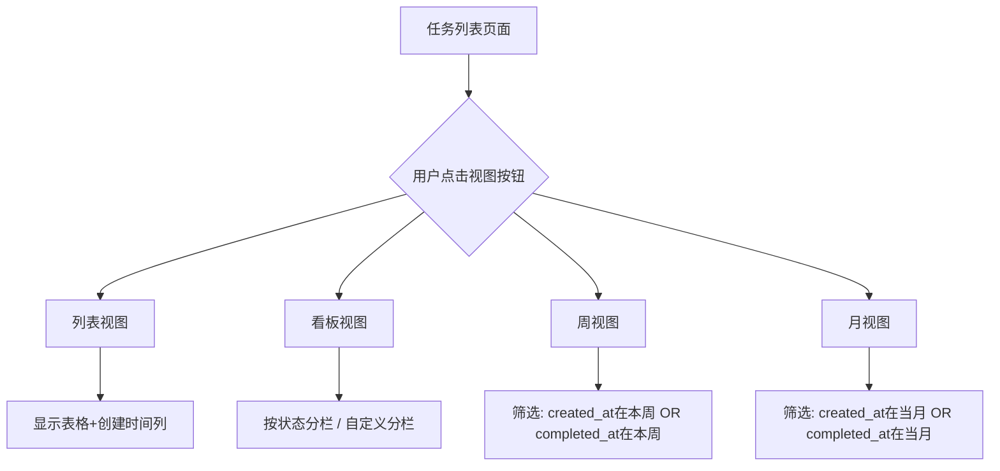

# 任务中心优化技术设计文档

## 1. 系统概要 (System Summary)
> 本次优化主要涉及任务中心的前端展示和交互功能，包括：任务列表新增创建时间列、任务详情页显示创建时间和周信息、新增周视图和月视图筛选功能、修复并增强看板视图的分栏能力。

### 技术路线
- **前端框架**：React + TypeScript + TailwindCSS
- **路由**：React Router
- **状态管理**：React useState/useMemo
- **现有组件复用**：TaskTable、TaskKanban（需修复）、MobileTaskCard

### 涉及改动模块
- `src/pages/tasks/TaskList.tsx`：新增视图切换按钮、时间筛选逻辑
- `src/pages/tasks/components/TaskTable.tsx`：新增创建时间列
- `src/pages/tasks/components/TaskKanban.tsx`：修复并增强看板视图
- `src/pages/tasks/components/MobileTaskCard.tsx`：新增创建时间显示
- `src/pages/tasks/TaskDetailPage.tsx`：新增创建时间及周信息显示

## 2. 决策记录 (Decision Rationale)
- **原方案选择**：在 TaskTable 中直接添加创建时间列，在 TaskDetailPage 中添加新字段展示
- **权衡 (Trade-offs)**：
  - 复用现有筛选逻辑，只新增视图类型（week/month）
  - 看板视图基于现有 TaskKanban 组件扩展，支持自定义分栏维度

## 3. 详细设计 (Detailed Design)

### 3.1 逻辑流程 (Logic Flow)


### 3.2 目录与模块结构 (Structure)
- `src/pages/tasks/TaskList.tsx`：新增 weekView/monthView 状态、视图切换按钮、时间范围筛选逻辑
- `src/pages/tasks/components/TaskTable.tsx`：新增"创建时间"列
- `src/pages/tasks/components/TaskKanban.tsx`：修复点击无效问题，增强自定义分栏功能
- `src/pages/tasks/components/MobileTaskCard.tsx`：新增创建时间显示
- `src/pages/tasks/TaskDetailPage.tsx`：新增创建时间及周信息显示
- `src/utils/dateUtils.ts`：新增获取年第N周和星期几的工具函数

### 3.3 数据模型 (Data Models)
```typescript
// Task 类型已存在，新增视图类型定义
export type TaskViewMode = 'list' | 'kanban' | 'week' | 'month';

// 看板视图分栏维度
export type KanbanGroupBy = 'status' | 'project' | 'priority' | 'assignee';

// 时间筛选结果
interface TimeFilterResult {
  createdInRange: Task[];
  completedInRange: Task[];
}
```

### 3.4 交互接口 (APIs / Props)

#### TaskTable 新增列
```typescript
interface TaskTableProps {
  // ... 现有props
  showCreatedAt?: boolean; // 是否显示创建时间列
}
```

#### TaskKanban 新增分栏配置
```typescript
interface TaskKanbanProps {
  // ... 现有props
  groupBy?: KanbanGroupBy; // 分栏维度
  onGroupByChange?: (groupBy: KanbanGroupBy) => void; // 分栏切换回调
}
```

#### 周视图/月视图筛选逻辑
```typescript
// 计算本周时间范围（周一至周日）
const getWeekRange = (date: Date): { start: Date; end: Date } => {
  const now = new Date(date);
  const day = now.getDay();
  const diff = now.getDate() - day + (day === 0 ? -6 : 1); // 调整到周一
  const start = new Date(now.setDate(diff));
  start.setHours(0, 0, 0, 0);
  const end = new Date(start);
  end.setDate(start.getDate() + 6);
  end.setHours(23, 59, 59, 999);
  return { start, end };
};

// 计算当月时间范围
const getMonthRange = (date: Date): { start: Date; end: Date } => {
  const start = new Date(date.getFullYear(), date.getMonth(), 1);
  const end = new Date(date.getFullYear(), date.getMonth() + 1, 0, 23, 59, 59, 999);
  return { start, end };
};
```

#### 创建时间周信息格式化
```typescript
// 获取年第N周和星期几
const getWeekInfo = (date: Date): { weekNumber: number; dayOfWeek: string } => {
  const year = date.getFullYear();
  const firstDayOfYear = new Date(year, 0, 1);
  const pastDaysOfYear = (date.getTime() - firstDayOfYear.getTime()) / 86400000;
  const weekNumber = Math.ceil((pastDaysOfYear + firstDayOfYear.getDay() + 1) / 7);
  
  const dayOfWeekArr = ['周日', '周一', '周二', '周三', '周四', '周五', '周六'];
  const dayOfWeek = dayOfWeekArr[date.getDay()];
  
  return { weekNumber, dayOfWeek };
};

// 格式化显示
const formatCreatedAtWithWeek = (date: Date): string => {
  const { weekNumber, dayOfWeek } = getWeekInfo(date);
  return `${date.getFullYear()}年${String(date.getMonth() + 1).padStart(2, '0')}月${String(date.getDate()).padStart(2, '0')}日 ${dayOfWeek}（第${weekNumber}周）`;
};
```

## 4. 安全性与异常处理 (Security & Error Handling)
- **空值处理**：当 created_at 为空时，显示 "-"
- **时区处理**：统一使用本地时区显示时间
- **边界处理**：
  - 周视图：使用 ISO 周历计算，正确处理跨年
  - 月视图：使用月末最后一天作为结束日期
- **视图切换**：切换视图时保留现有筛选条件

## 5. 验证方案 (Verification Plan)
- **手动验证**：
  1. 进入任务列表，确认表格显示"创建时间"列
  2. 点击任务详情，确认显示"创建时间"及周信息
  3. 点击周视图按钮，确认筛选出本周新建和本周完成的任务
  4. 点击月视图按钮，确认筛选出当月新建和当月完成的任务
  5. 点击看板视图，确认正常切换并显示分栏
  6. 切换看板视图的分栏维度，确认分组正确
  7. 移动端测试看板视图的横向滚动
