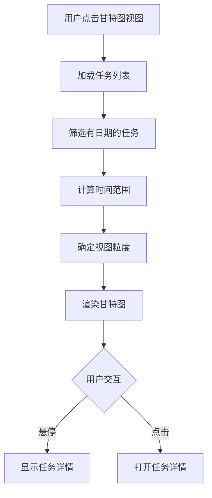

# 任务甘特图视图技术设计文档

## 1. 系统概要 (System Summary)

本功能为任务中心新增甘特图视图模块，基于现有任务数据，利用纯 CSS + React 实现轻量级甘特图展示。

**技术路线**：
- 使用纯 CSS Flexbox/Grid 实现甘特图布局
- 使用 date-fns 处理日期计算
- 自定义 Hook 管理甘特图状态
- 复用现有任务服务 API

**涉及模块改动**：
- 新增甘特图视图组件
- 新增甘特图相关 hooks
- 更新任务中心视图切换

---

## 2. 决策记录 (Decision Rationale)

### 方案对比

| 方案 | 优点 | 缺点 | 结论 |
|------|------|------|------|
| gantt-task-react | 功能完整，开箱即用 | 样式定制困难，与现有UI不统一 | ❌ 不采用 |
| 自研甘特图 | 完全可控，样式统一 | 需要开发时间 | ✅ 采用 |
| react-gantt-task | 轻量级 | 维护不活跃 | ❌ 不采用 |

### 技术选型理由
- **自研方案**：轻量、可控、与现有 UI 风格一致
- **日期处理**：使用 date-fns（项目已采用）
- **响应式**：支持横向滚动，适配不同屏幕

---

## 3. 详细设计 (Detailed Design)

### 3.1 逻辑流程



### 3.2 目录与模块结构

```
src/
├── components/
│   └── task/
│       ├── TaskGantt.tsx           # 甘特图主组件
│       ├── GanttTimeline.tsx       # 时间轴组件
│       ├── GanttTaskBar.tsx       # 任务条组件
│       └── GanttDependency.tsx    # 依赖关系组件
├── hooks/
│   └── useGantt.ts                # 甘特图逻辑 hook
└── pages/
    └── tasks/
        └── TaskList.tsx           # 集成甘特图
```

### 3.3 数据模型

```typescript
// 甘特图任务项
export interface GanttTask {
  id: string;
  title: string;
  startDate: Date | null;
  endDate: Date | null;
  progress: number;
  status: 'todo' | 'in_progress' | 'paused' | 'done' | 'canceled';
  priority: 'low' | 'medium' | 'high' | 'urgent';
  assignees?: Array<{
    id: string;
    user_id: string;
    user?: { full_name: string; avatar_url: string };
  }>;
  dependencies?: string[];  // 依赖的任务ID
}

// 甘特图配置
export interface GanttConfig {
  viewMode: 'day' | 'week' | 'month';
  columnWidth: number;
  rowHeight: number;
  barHeight: number;
}

// 时间轴列
export interface GanttColumn {
  date: Date;
  label: string;
  isWeekend: boolean;
  isToday: boolean;
}
```

### 3.4 交互接口

**Props 定义**
```typescript
interface TaskGanttProps {
  tasks: TaskWithDetails[];
  onTaskClick?: (taskId: string) => void;
  onDateChange?: (taskId: string, startDate: Date, endDate: Date) => void;
}
```

---

## 4. 甘特图布局设计

### 4.1 整体布局

```
┌─────────────────────────────────────────────────────────────┐
│  任务名称 │ 时间轴区域                                        │
├──────────┼────────────────────────────────────────────────┤
│ 任务1    │ ████████████                                    │
│ 任务2    │        ██████████████                          │
│ 任务3    │                 ██████████ ← 进度              │
│ ...      │                                                    │
└──────────┴────────────────────────────────────────────────┘
```

### 4.2 时间轴头部

- 根据视图模式显示日期标签
- 周末背景高亮
- "今天"位置标记

### 4.3 任务条样式

| 状态 | 颜色 |
|------|------|
| 待办 | #94a3b8 (灰色) |
| 进行中 | #3b82f6 (蓝色) |
| 已暂停 | #f59e0b (黄色) |
| 已完成 | #22c55e (绿色) |
| 已取消 | #6b7280 (灰色) |
| 逾期 | #ef4444 (红色) |

---

## 5. 边缘情况处理

### 5.1 无日期任务
- 显示在甘特图底部"无计划任务"区域
- 显示任务名称，但不显示时间条

### 5.2 单日任务
- 最小显示宽度为1天

### 5.3 跨月任务
- 跨越多个月份的任务条连续显示

---

## 6. 验证方案

### 6.1 功能验证
- [ ] 甘特图正确渲染任务时间条
- [ ] 时间轴正确显示日期
- [ ] 任务条颜色正确反映状态
- [ ] 悬停显示任务详情
- [ ] 点击任务打开详情页

### 6.2 视图适配
- [ ] 视图自动适配时间范围
- [ ] 横向滚动正常
- [ ] 移动端显示正常

---

## 7. 技术依赖

| 依赖包 | 用途 |
|--------|------|
| date-fns | 日期计算和格式化 |
| 项目现有样式系统 | UI 样式统一 |

无需新增额外依赖。
