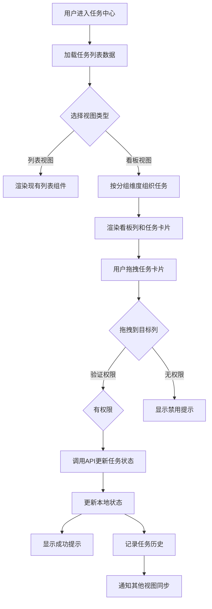

# 任务看板视图技术设计文档

## 1. 系统概要 (System Summary)

本功能为任务中心新增看板视图模块，基于现有任务数据模型，利用 `@dnd-kit` 库实现拖拽交互，提供可视化任务管理体验。

**技术路线**：
- 使用 `@dnd-kit/core` 和 `@dnd-kit/sortable` 实现拖拽功能
- 新增 `TaskKanban` 组件，集成到现有任务中心页面
- 利用 Zustand 进行看板状态管理
- 复用现有 `taskService` API 接口

**涉及模块改动**：
- 新增看板视图组件
- 新增看板相关 hooks
- 更新任务中心页面路由和选项卡

---

## 2. 决策记录 (Decision Rationale)

### 方案对比

| 方案 | 优点 | 缺点 | 结论 |
|------|------|------|------|
| react-beautiful-dnd | 成熟稳定，文档丰富 | 不支持 React 18 Strict Mode，已停止维护 | ❌ 不采用 |
| @dnd-kit | 支持 React 18，完全可定制，模块化设计 | 学习曲线稍高 | ✅ 采用 |
| react-dnd | 功能强大，灵活 | API 复杂，样板代码多 | ❌ 不采用 |
| native HTML5 DnD | 无依赖 | 移动端支持差，功能有限 | ❌ 不采用 |

### 技术选型理由
- **@dnd-kit**：React 生态中最活跃的拖拽库，支持键盘操作、无障碍、虚拟化
- **状态管理**：使用 Zustand（现有项目已采用）管理看板状态
- **性能优化**：使用 React.memo 和虚拟滚动优化大量任务场景

---

## 3. 详细设计 (Detailed Design)

### 3.1 逻辑流程



### 3.2 目录与模块结构

```
src/
├── components/
│   ├── task/
│   │   ├── TaskKanban.tsx          # 看板主组件
│   │   ├── KanbanColumn.tsx        # 看板列组件
│   │   ├── KanbanCard.tsx          # 任务卡片组件
│   │   ├── KanbanBoard.tsx         # 拖拽容器
│   │   └── TaskQuickAction.tsx     # 快速操作组件
│   └── common/
│       ├── EmptyState.tsx          # 空状态组件
│       └── Avatar.tsx              # 头像组件（已存在）
├── hooks/
│   ├── useKanban.ts                # 看板核心逻辑 hook
│   ├── useKanbanDrag.ts            # 拖拽逻辑 hook
│   └── useTaskActions.ts           # 任务操作 hook
├── services/
│   └── taskService.ts              # 现有服务（复用）
├── store/
│   └── useTaskStore.ts            # 任务状态管理（扩展）
├── types/
│   └── task.ts                    # 现有类型（扩展）
├── pages/
│   └── tasks/
│       └── TaskCenter.tsx         # 任务中心页面（修改）
```

### 3.3 数据模型

```typescript
// 看板分组维度类型
export type KanbanGroupBy = 'status' | 'priority' | 'assignee' | 'module';

// 看板列配置
export interface KanbanColumn {
  id: string;                    // 列唯一标识
  title: string;                 // 列标题
  value: string;                 // 对应的值（status/priority等）
  color?: string;                // 列颜色
  order: number;                 // 排序顺序
}

// 看板配置（用户偏好）
export interface KanbanConfig {
  groupBy: KanbanGroupBy;        // 当前分组维度
  columns: KanbanColumn[];       // 列配置
  isConfigOpen: boolean;         // 配置面板是否打开
}

// 看板任务项（带UI状态）
export interface KanbanTask extends Task {
  isDragging?: boolean;          // 是否正在拖拽
  isOverdue?: boolean;           // 是否逾期
}

// 看板状态
export interface KanbanState {
  tasks: KanbanTask[];           // 所有任务
  columns: KanbanColumn[];      // 列配置
  groupBy: KanbanGroupBy;       // 当前分组维度
  isLoading: boolean;            // 加载状态
  error: string | null;           // 错误信息
}
```

### 3.4 交互接口

#### Props 定义

**TaskKanban Props**
```typescript
interface TaskKanbanProps {
  projectId: string;
  tasks: Task[];
  onTaskClick?: (task: Task) => void;
  onTaskUpdate?: (taskId: string, updates: Partial<Task>) => void;
}
```

**KanbanColumn Props**
```typescript
interface KanbanColumnProps {
  column: KanbanColumn;
  tasks: KanbanTask[];
  onTaskClick: (task: KanbanTask) => void;
}
```

**KanbanCard Props**
```typescript
interface KanbanCardProps {
  task: KanbanTask;
  onClick: () => void;
  onAssign: () => void;
  onEdit: () => void;
  isDraggable: boolean;
}
```

#### API Endpoints

| 操作 | 方法 | 路径 | Input | Output |
|------|------|------|-------|--------|
| 获取任务列表 | GET | `/tasks?project_id={id}` | projectId | Task[] |
| 更新任务状态 | PATCH | `/tasks/{id}` | { status: string } | Task |
| 创建任务 | POST | `/tasks` | CreateTaskRequest | Task |
| 删除任务 | DELETE | `/tasks/{id}` | - | void |

---

## 4. 安全性与异常处理

### 4.1 防御性编程
- **输入验证**：拖拽目标列ID必须存在于列配置中
- **空值处理**：任务列表为null/undefined时显示空状态
- **网络错误**：API调用失败时显示错误提示，保留原状态
- **防抖处理**：拖拽结束时使用防抖避免频繁API调用

### 4.2 权限校验
- 拖拽前检查用户是否为项目成员
- 检查任务更新权限（创建者/负责人/项目经理可更新）
- 团队成员只能更新自己创建的任务

### 4.3 并发处理
- 使用乐观更新：先更新UI，后调用API
- API失败时回滚状态并显示错误
- 使用任务ID+版本号实现冲突检测（可选）

---

## 5. 验证方案

### 5.1 自动化测试

**单元测试**
- `KanbanCard.test.tsx`：渲染测试
- `useKanban.test.ts`：状态管理测试

**集成测试**
- 拖拽任务更新状态流程
- 权限校验流程

### 5.2 手动验证步骤

1. **基础功能验证**
   - [ ] 进入任务中心，点击"看板视图"选项卡
   - [ ] 验证任务按状态列分组显示
   - [ ] 验证任务卡片显示标题、优先级、截止日期、负责人

2. **拖拽功能验证**
   - [ ] 拖拽任务从"待办"列到"进行中"列
   - [ ] 验证任务状态已更新
   - [ ] 验证其他视图（列表）同步更新
   - [ ] 验证任务历史记录新增

3. **列配置验证**
   - [ ] 点击"配置列"按钮
   - [ ] 切换分组维度为"优先级"
   - [ ] 验证看板按优先级重新分组

4. **边缘情况验证**
   - [ ] 空列显示"暂无任务"提示
   - [ ] 无权限用户禁用拖拽
   - [ ] 移动端横向滚动正常

---

## 6. 技术依赖

| 依赖包 | 版本 | 用途 |
|--------|------|------|
| @dnd-kit/core | ^6.x | 拖拽核心库 |
| @dnd-kit/sortable | ^8.x | 可排序列表 |
| @dnd-kit/utilities | ^3.x | 拖拽工具函数 |
| react-window | ^1.8.x | 虚拟滚动（大量任务场景） |
