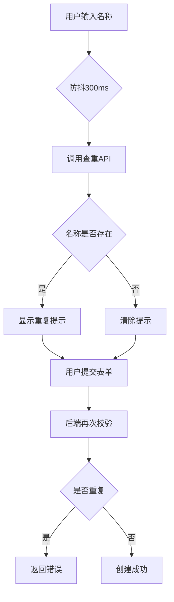
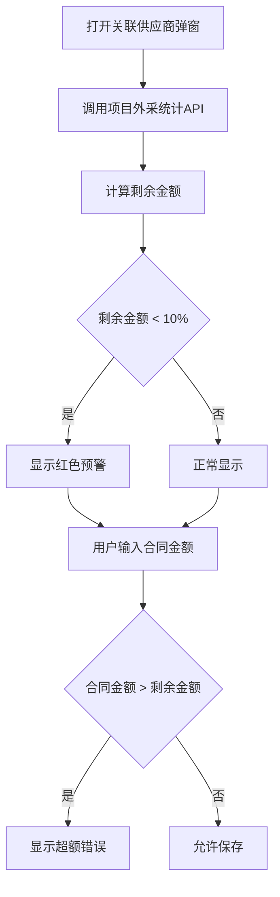
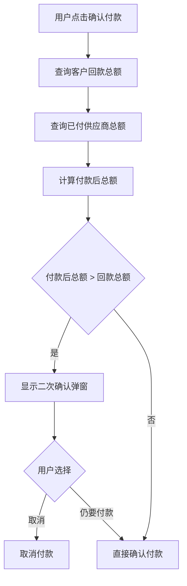
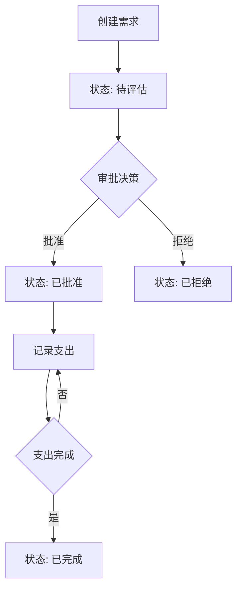

# 用户体验优化技术设计文档

## 1. 系统概要 (System Summary)

本次优化包含四大功能模块，将分别对前后端进行扩展：

| 模块 | 前端改动 | 后端改动 |
|-----|---------|---------|
| **查重机制** | 表单组件增加实时校验、防抖查重API调用 | 新增查重API端点、数据库唯一性检查 |
| **供应商外采金额提示** | 关联供应商弹窗增加金额统计卡片、预警提示 | 新增项目外采金额统计API |
| **客户回款管理** | 项目详情新增回款管理Tab、回款记录列表、新增回款弹窗 | 新增回款CRUD API、客户回款统计API |
| **合同外需求管理** | 项目详情新增合同外需求Tab、需求列表、状态流转 | 新增需求CRUD API、支出记录API |

**集成方式**：
- 前端：在项目详情页新增 Tab，扩展现有表单组件
- 后端：新增 REST API 端点，复用现有数据库连接和权限中间件

---

## 2. 决策记录 (Decision Rationale)

### 2.1 方案选择

| 决策点 | 方案A | 方案B（选中） | 原因 |
|-------|-------|-------------|------|
| 查重触发时机 | 提交时统一校验 | 实时防抖校验 | 提前发现问题，减少用户等待 |
| 任务查重范围 | 全局查重 | 可见范围查重 | 满足不同项目任务名可重复的业务需求 |
| 回款-付款联动 | 硬性阻止超额付款 | 二次确认机制 | 保留灵活性，同时提醒风险 |
| 合同外需求状态 | 简单开关 | 多状态流转 | 支持审批流程，符合实际业务 |

### 2.2 权衡 (Trade-offs)

- **实时查重 vs 性能**：采用防抖(300ms)减少API调用，平衡实时性和服务器压力
- **数据一致性 vs 灵活性**：供应商金额超额时允许二次确认，而非硬性阻止，保留业务灵活性
- **功能完整性 vs 开发周期**：合同外需求先实现核心状态流转，复杂审批流后续迭代

---

## 3. 详细设计 (Detailed Design)

### 3.1 逻辑流程 (Logic Flow)

#### 3.1.1 名称查重流程


#### 3.1.2 供应商外采金额计算流程


#### 3.1.3 客户回款与供应商付款联动流程


#### 3.1.4 合同外需求状态流转


### 3.2 目录与模块结构 (Structure)

```
api-new/src/
├── routes/
│   └── projects.ts              # 扩展：新增回款、合同外需求相关路由
├── services/
│   ├── duplicateCheckService.ts # 新增：查重服务
│   ├── projectFinanceService.ts # 新增：项目财务统计服务
│   └── clientPaymentService.ts  # 新增：客户回款服务

design-system/src/
├── components/
│   ├── DuplicateCheckInput/     # 新增：带查重功能的输入框组件
│   │   ├── index.tsx
│   │   └── types.ts
│   ├── ProjectSupplierModal/    # 修改：增加金额统计卡片
│   ├── ClientPaymentTab/        # 新增：回款管理Tab
│   │   ├── index.tsx
│   │   ├── PaymentForm.tsx
│   │   └── PaymentList.tsx
│   └── ExtraRequirementTab/     # 新增：合同外需求Tab
│       ├── index.tsx
│       ├── RequirementForm.tsx
│       ├── RequirementList.tsx
│       └── ExpenseForm.tsx
├── hooks/
│   ├── useDuplicateCheck.ts     # 新增：查重Hook
│   ├── useProjectFinance.ts     # 新增：项目财务Hook
│   └── useClientPayment.ts      # 新增：客户回款Hook
└── api/
    └── projectFinance.ts        # 新增：项目财务相关API
```

### 3.3 数据模型 (Data Models)

```typescript
// ==================== 查重相关 ====================

interface DuplicateCheckRequest {
  type: 'project' | 'task' | 'supplier' | 'client';
  name: string;
  excludeId?: string;  // 编辑时排除自身
}

interface DuplicateCheckResponse {
  exists: boolean;
  existingItem?: {
    id: string;
    name: string;
    createdAt: string;
  };
}

// ==================== 供应商外采金额相关 ====================

interface ProjectProcurementStats {
  projectAmount: number;           // 项目总金额
  totalContractAmount: number;     // 已关联供应商合同金额合计
  remainingAmount: number;         // 剩余可外采金额
  remainingPercentage: number;     // 剩余金额百分比
  supplierContracts: SupplierContractSummary[];
}

interface SupplierContractSummary {
  supplierId: string;
  supplierName: string;
  contractAmount: number;
}

// ==================== 客户回款相关 ====================

interface ClientPayment {
  id: string;
  projectId: string;
  clientId: string;
  amount: number;
  paymentDate: string;
  paymentMethod?: string;
  notes?: string;
  createdBy: string;
  createdAt: string;
}

interface ClientPaymentFormData {
  amount: number;
  paymentDate: string;
  paymentMethod?: string;
  notes?: string;
}

interface ProjectPaymentStats {
  contractAmount: number;          // 合同金额
  totalClientPayment: number;      // 客户回款合计
  totalSupplierPayment: number;    // 供应商付款合计
  remainingClientPayment: number;  // 客户未回款
  remainingSupplierPayment: number;// 供应商未付款
}

// ==================== 合同外需求相关 ====================

type ExtraRequirementStatus = 'pending' | 'approved' | 'rejected' | 'completed';

interface ExtraRequirement {
  id: string;
  projectId: string;
  name: string;
  description?: string;
  estimatedCost?: number;
  actualCost: number;
  status: ExtraRequirementStatus;
  requestedBy?: string;
  requestDate?: string;
  approvalDate?: string;
  approvedBy?: string;
  completionDate?: string;
  notes?: string;
  createdBy: string;
  createdAt: string;
}

interface ExtraRequirementFormData {
  name: string;
  description?: string;
  estimatedCost?: number;
  requestedBy?: string;
  requestDate?: string;
  notes?: string;
}

interface ExtraRequirementExpense {
  id: string;
  requirementId: string;
  amount: number;
  expenseDate: string;
  supplierId?: string;
  supplierName?: string;
  description?: string;
  createdBy: string;
  createdAt: string;
}

interface ExtraRequirementExpenseFormData {
  amount: number;
  expenseDate: string;
  supplierId?: string;
  description?: string;
}
```

### 3.4 交互接口 (APIs / Props)

#### 3.4.1 查重API

```typescript
// POST /api/duplicate-check
// 请求体
interface DuplicateCheckBody {
  type: 'project' | 'task' | 'supplier' | 'client';
  name: string;
  excludeId?: string;
  projectId?: string;  // 任务查重时需要
}

// 响应
interface DuplicateCheckResult {
  exists: boolean;
  existingItem?: {
    id: string;
    name: string;
    createdAt: string;
  };
}
```

#### 3.4.2 项目外采统计API

```typescript
// GET /api/projects/:id/procurement-stats
// 响应
interface ProcurementStatsResponse {
  projectAmount: number;
  totalContractAmount: number;
  remainingAmount: number;
  remainingPercentage: number;
  supplierContracts: Array<{
    supplierId: string;
    supplierName: string;
    contractAmount: number;
  }>;
}
```

#### 3.4.3 客户回款API

```typescript
// GET /api/projects/:id/client-payments
// 响应: ClientPayment[]

// POST /api/projects/:id/client-payments
// 请求体: ClientPaymentFormData
// 响应: ClientPayment

// DELETE /api/client-payments/:id
// 响应: { success: boolean }
```

#### 3.4.4 供应商付款余额检查API

```typescript
// GET /api/projects/:id/payment-balance-check
// 查询参数: ?plannedPaymentAmount=100000
// 响应
interface PaymentBalanceCheckResponse {
  canProceed: boolean;
  clientTotalPayment: number;
  supplierTotalPaid: number;
  plannedPaymentAmount: number;
  projectedTotal: number;
  deficit: number;
  message: string;
}
```

#### 3.4.5 合同外需求API

```typescript
// GET /api/projects/:id/extra-requirements
// 响应: ExtraRequirement[]

// POST /api/projects/:id/extra-requirements
// 请求体: ExtraRequirementFormData
// 响应: ExtraRequirement

// PATCH /api/extra-requirements/:id/status
// 请求体: { status: ExtraRequirementStatus; approvalDate?: string }
// 响应: ExtraRequirement

// GET /api/extra-requirements/:id/expenses
// 响应: ExtraRequirementExpense[]

// POST /api/extra-requirements/:id/expenses
// 请求体: ExtraRequirementExpenseFormData
// 响应: ExtraRequirementExpense
```

#### 3.4.6 组件Props定义

```typescript
// DuplicateCheckInput 组件
interface DuplicateCheckInputProps {
  type: 'project' | 'task' | 'supplier' | 'client';
  value: string;
  onChange: (value: string, isDuplicate: boolean) => void;
  excludeId?: string;
  projectId?: string;  // 任务查重时需要
  debounceMs?: number; // 默认300ms
  placeholder?: string;
  required?: boolean;
}

// ProjectSupplierModal 扩展
interface ProjectSupplierModalProps {
  projectId: string;
  projectAmount: number;
  isOpen: boolean;
  onClose: () => void;
  onSuccess: () => void;
}

// ClientPaymentTab 组件
interface ClientPaymentTabProps {
  projectId: string;
  clientId?: string;
}

// ExtraRequirementTab 组件
interface ExtraRequirementTabProps {
  projectId: string;
}
```

---

## 4. 安全性与异常处理 (Security & Error Handling)

### 4.1 防御性编程

| 场景 | 处理方案 |
|-----|---------|
| 查重API被恶意频繁调用 | 后端增加速率限制(10次/分钟)，前端防抖300ms |
| 并发修改供应商合同金额 | 数据库事务 + 乐观锁（使用updated_at校验） |
| 回款金额输入负数 | 前端校验 + 后端校验，拒绝负数金额 |
| 删除已被引用的回款记录 | 软删除或禁止删除，保留财务审计痕迹 |
| 合同外需求支出超过预估 | 警告提示，但允许记录（业务灵活性） |

### 4.2 权限校验

| 功能 | 权限要求 |
|-----|---------|
| 名称查重 | 登录用户均可 |
| 查看外采金额统计 | 项目成员 |
| 关联供应商 | 项目经理、系统管理员 |
| 查看回款记录 | 项目成员 |
| 新增/删除回款 | 项目经理、系统管理员 |
| 查看合同外需求 | 项目成员 |
| 新增/修改需求 | 项目经理、系统管理员 |
| 审批需求状态 | 项目经理、系统管理员 |
| 记录需求支出 | 项目经理、系统管理员 |

### 4.3 错误处理

```typescript
// 统一错误码定义
enum ErrorCode {
  DUPLICATE_NAME = 'DUPLICATE_NAME',
  INSUFFICIENT_BUDGET = 'INSUFFICIENT_BUDGET',
  PAYMENT_EXCEEDS_REVENUE = 'PAYMENT_EXCEEDS_REVENUE',
  INVALID_STATUS_TRANSITION = 'INVALID_STATUS_TRANSITION',
  PERMISSION_DENIED = 'PERMISSION_DENIED',
}

// 错误响应格式
interface ErrorResponse {
  code: ErrorCode;
  message: string;
  details?: Record<string, any>;
}
```

---

## 5. 验证方案 (Verification Plan)

### 5.1 自动化测试

#### 单元测试
```typescript
// 查重服务测试
describe('DuplicateCheckService', () => {
  it('should detect duplicate project name', async () => {});
  it('should ignore case when checking duplicates', async () => {});
  it('should exclude self when editing', async () => {});
  it('should check tasks within visible scope only', async () => {});
});

// 项目财务服务测试
describe('ProjectFinanceService', () => {
  it('should calculate remaining procurement amount correctly', async () => {});
  it('should detect low remaining budget (<10%)', async () => {});
  it('should prevent exceeding remaining budget', async () => {});
});

// 客户回款服务测试
describe('ClientPaymentService', () => {
  it('should create payment record and update stats', async () => {});
  it('should calculate payment balance correctly', async () => {});
  it('should detect payment exceeding revenue', async () => {});
});
```

#### 集成测试
- 查重API端到端测试
- 供应商关联-金额计算联动测试
- 回款-付款联动测试
- 合同外需求状态流转测试

### 5.2 手动验证步骤

#### 查重机制验证
1. 创建项目A，名称为"测试项目"
2. 再次创建项目，输入相同名称，验证实时提示
3. 修改名称后提示消失
4. 提交时再次验证阻止重复创建
5. 编辑项目A，名称不变，验证可通过
6. 创建任务，验证仅在当前项目内查重

#### 供应商金额验证
1. 创建金额100万的项目
2. 关联供应商A，合同金额30万
3. 关联供应商B，验证显示剩余70万
4. 尝试输入80万，验证阻止并提示
5. 关联多个供应商使剩余金额<10%
6. 验证显示红色预警

#### 回款管理验证
1. 在项目详情点击回款管理Tab
2. 新增回款记录，验证统计更新
3. 在供应商付款页面确认付款
4. 验证当付款超回款时弹出二次确认

#### 合同外需求验证
1. 创建合同外需求，状态为待评估
2. 批准需求，验证状态变更
3. 记录支出，验证实际成本更新
4. 完成所有支出，验证状态可标记为已完成
5. 验证列表筛选和统计

---

## 6. 数据库迁移脚本

```sql
-- 001_add_client_payments.sql
CREATE TABLE IF NOT EXISTS client_payments (
    id UUID PRIMARY KEY DEFAULT gen_random_uuid(),
    project_id UUID REFERENCES projects(id) ON DELETE CASCADE NOT NULL,
    client_id UUID REFERENCES clients(id) ON DELETE CASCADE NOT NULL,
    amount DECIMAL(15, 2) NOT NULL CHECK (amount > 0),
    payment_date DATE NOT NULL,
    payment_method TEXT,
    notes TEXT,
    created_by UUID REFERENCES profiles(id),
    created_at TIMESTAMPTZ DEFAULT NOW() NOT NULL,
    updated_at TIMESTAMPTZ DEFAULT NOW() NOT NULL
);

CREATE INDEX idx_client_payments_project_id ON client_payments(project_id);
CREATE INDEX idx_client_payments_client_id ON client_payments(client_id);
CREATE INDEX idx_client_payments_payment_date ON client_payments(payment_date);

CREATE TRIGGER update_client_payments_updated_at
    BEFORE UPDATE ON client_payments
    FOR EACH ROW
    EXECUTE FUNCTION update_updated_at_column();

-- 002_add_extra_requirements.sql
CREATE TABLE IF NOT EXISTS extra_requirements (
    id UUID PRIMARY KEY DEFAULT gen_random_uuid(),
    project_id UUID REFERENCES projects(id) ON DELETE CASCADE NOT NULL,
    name TEXT NOT NULL,
    description TEXT,
    estimated_cost DECIMAL(15, 2) CHECK (estimated_cost >= 0),
    actual_cost DECIMAL(15, 2) DEFAULT 0 CHECK (actual_cost >= 0),
    status TEXT DEFAULT 'pending' CHECK (status IN ('pending', 'approved', 'rejected', 'completed')),
    requested_by TEXT,
    request_date DATE,
    approval_date DATE,
    approved_by UUID REFERENCES profiles(id),
    completion_date DATE,
    notes TEXT,
    created_by UUID REFERENCES profiles(id),
    created_at TIMESTAMPTZ DEFAULT NOW() NOT NULL,
    updated_at TIMESTAMPTZ DEFAULT NOW() NOT NULL
);

CREATE INDEX idx_extra_requirements_project_id ON extra_requirements(project_id);
CREATE INDEX idx_extra_requirements_status ON extra_requirements(status);

CREATE TRIGGER update_extra_requirements_updated_at
    BEFORE UPDATE ON extra_requirements
    FOR EACH ROW
    EXECUTE FUNCTION update_updated_at_column();

-- 003_add_extra_requirement_expenses.sql
CREATE TABLE IF NOT EXISTS extra_requirement_expenses (
    id UUID PRIMARY KEY DEFAULT gen_random_uuid(),
    requirement_id UUID REFERENCES extra_requirements(id) ON DELETE CASCADE NOT NULL,
    amount DECIMAL(15, 2) NOT NULL CHECK (amount > 0),
    expense_date DATE NOT NULL,
    supplier_id UUID REFERENCES suppliers(id),
    description TEXT,
    created_by UUID REFERENCES profiles(id),
    created_at TIMESTAMPTZ DEFAULT NOW() NOT NULL,
    updated_at TIMESTAMPTZ DEFAULT NOW() NOT NULL
);

CREATE INDEX idx_extra_req_expenses_requirement_id ON extra_requirement_expenses(requirement_id);
CREATE INDEX idx_extra_req_expenses_supplier_id ON extra_requirement_expenses(supplier_id);

CREATE TRIGGER update_extra_req_expenses_updated_at
    BEFORE UPDATE ON extra_requirement_expenses
    FOR EACH ROW
    EXECUTE FUNCTION update_updated_at_column();
```

---

## 7. 修订记录

| 版本 | 日期 | 修订内容 | 修订人 |
|-----|------|---------|-------|
| 1.0 | 2026-02-17 | 初始版本，包含四大模块的技术设计、API定义、数据模型 | AI Assistant |
