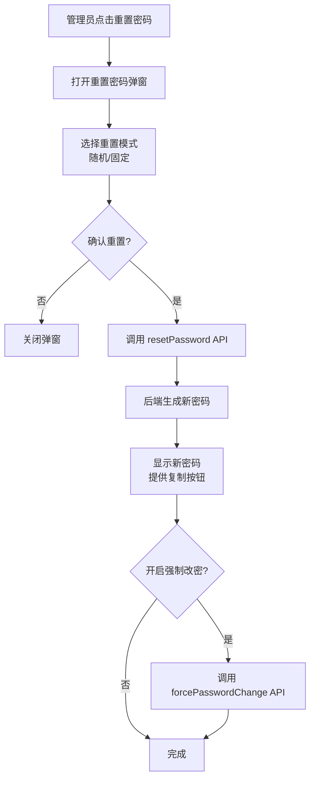
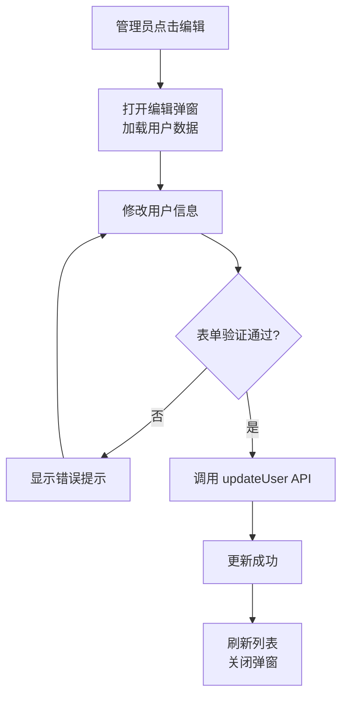

# 用户管理模块重构技术设计文档

## 1. 系统概要

本次重构将完善用户管理模块，实现完整的 CRUD 功能：新增用户、编辑用户、重置密码、禁用/启用用户。

**核心改动**：
- **前端**：重构 UserManagement 组件，提取 UserForm、UserTable、ResetPasswordModal 等子组件，新增 adminUserService 统一封装 API 调用
- **后端**：补充 `/auth/v1/admin/users/:id/reset-password` 接口，支持两种重置模式（随机/固定）和强制改密开关
- **数据库**：profiles 表新增 `force_password_change` 字段标记强制改密状态

## 2. 决策记录

### 2.1 方案选择

| 方案 | 说明 | 优缺点 |
|-----|------|--------|
| **方案A：直接修复现有代码** | 在现有 UserManagement.tsx 上补充功能 | ❌ 代码会越来越臃肿，难以维护 |
| **方案B：组件化重构（选中）** | 提取子组件，封装 Service 层 | ✅ 结构清晰，可维护性高，符合项目规则 |

**选择理由**：
- 项目规则要求"超过 60 行的代码优先抽象为函数或模块"
- 现有 UserManagement.tsx 已达 430 行，急需拆分
- 封装 Service 层可避免前端直接调用 fetch，统一错误处理

### 2.2 权衡

- **牺牲**：短期内需要更多开发时间进行重构
- **换取**：长期可维护性、代码复用性、一致的开发模式

## 3. 详细设计

### 3.1 逻辑流程

#### 重置密码流程


#### 编辑用户流程


### 3.2 目录与模块结构

```
src/
├── pages/system/tabs/
│   └── UserManagement/           # 用户管理模块目录
│       ├── index.tsx             # 主入口（原 UserManagement.tsx 重构）
│       ├── components/
│       │   ├── UserTable.tsx     # 用户列表表格
│       │   ├── UserForm.tsx      # 新增/编辑用户表单
│       │   ├── ResetPasswordModal.tsx  # 重置密码弹窗
│       │   └── ForcePasswordSwitch.tsx # 强制改密开关
│       └── hooks/
│           └── useUsers.ts       # 用户数据管理 Hook
├── services/
│   └── adminUserService.ts       # 管理员用户服务（新增）
└── types/
    └── admin.ts                  # 管理员相关类型（新增）

api-new/src/
├── routes/
│   └── auth.ts                   # 补充重置密码接口
└── services/
    └── authService.ts            # 补充重置密码逻辑
```

### 3.3 数据模型

#### 前端类型定义
```typescript
// src/types/admin.ts

/**
 * 重置密码模式
 */
export type ResetPasswordMode = 'random' | 'fixed';

/**
 * 重置密码请求
 */
export interface ResetPasswordRequest {
  userId: string;
  mode: ResetPasswordMode;
  fixedPassword?: string;  // mode='fixed' 时使用，默认 POP-101-ADA
}

/**
 * 重置密码响应
 */
export interface ResetPasswordResponse {
  success: boolean;
  newPassword: string;
  message: string;
}

/**
 * 强制改密请求
 */
export interface ForcePasswordChangeRequest {
  userId: string;
  force: boolean;  // true=强制, false=不强制
}

/**
 * 用户表单数据（新增/编辑）
 */
export interface UserFormData {
  username: string;
  full_name?: string;
  email?: string;
  password?: string;      // 新增时必填
  role: string;
  is_active?: boolean;    // 编辑时可修改
}
```

#### 后端类型定义
```typescript
// api-new/src/types/auth.ts

/**
 * 重置密码请求
 */
export interface ResetPasswordRequest {
  mode: 'random' | 'fixed';
  fixedPassword?: string;
}

/**
 * 强制改密请求
 */
export interface ForcePasswordChangeRequest {
  force: boolean;
}
```

### 3.4 交互接口

#### 前端 Service 层
```typescript
// src/services/adminUserService.ts

export const adminUserService = {
  /**
   * 获取用户列表
   */
  getUsers: (params?: { page?: number; limit?: number; search?: string }) => 
    Promise<{ users: Profile[]; total: number }>;

  /**
   * 创建用户
   */
  createUser: (data: UserFormData) => Promise<{ success: boolean; user: Profile }>;

  /**
   * 更新用户
   */
  updateUser: (id: string, data: Partial<UserFormData>) => Promise<{ success: boolean; user: Profile }>;

  /**
   * 重置密码
   */
  resetPassword: (userId: string, mode: ResetPasswordMode) => 
    Promise<{ success: boolean; newPassword: string }>;

  /**
   * 设置强制改密
   */
  setForcePasswordChange: (userId: string, force: boolean) => Promise<void>;

  /**
   * 禁用/启用用户
   */
  toggleUserStatus: (userId: string, isActive: boolean) => Promise<void>;
};
```

#### 后端 API 接口

| 接口 | 方法 | 路径 | 权限 |
|-----|------|------|------|
| 获取用户列表 | GET | `/auth/v1/admin/users` | admin |
| 创建用户 | POST | `/auth/v1/admin/users` | admin |
| 更新用户 | PUT | `/auth/v1/admin/users/:id` | admin |
| 重置密码 | POST | `/auth/v1/admin/users/:id/reset-password` | admin |
| 强制改密开关 | POST | `/auth/v1/admin/users/:id/force-password-change` | admin |
| 禁用用户 | DELETE | `/auth/v1/admin/users/:id` | admin |

**重置密码接口详情**：
```
POST /auth/v1/admin/users/:id/reset-password

Request Body:
{
  "mode": "random" | "fixed",
  "fixedPassword": "POP-101-ADA"  // mode='fixed' 时可选，不传使用默认值
}

Response:
{
  "success": true,
  "newPassword": "生成的密码",
  "message": "密码重置成功"
}
```

**强制改密接口详情**：
```
POST /auth/v1/admin/users/:id/force-password-change

Request Body:
{
  "force": true | false
}

Response:
{
  "success": true,
  "message": "强制改密已开启/关闭"
}
```

## 4. 安全性与异常处理

### 4.1 防御性编程

| 场景 | 处理方案 |
|-----|---------|
| 非法输入 | 表单验证（yup/zod），后端二次校验 |
| 网络故障 | Service 层统一捕获，Toast 提示 |
| 用户不存在 | 404 错误，提示"用户不存在" |
| 权限不足 | 403 错误，提示"权限不足" |

### 4.2 权限校验

- 所有管理员接口需要 `requireAuth` + `requireAdmin` 中间件
- 前端路由级别权限控制（已存在）
- 后端 API 级别权限控制（已存在）

## 5. 验证方案

### 5.1 自动化测试

| 测试类型 | 覆盖场景 |
|---------|---------|
| 单元测试 | UserForm 表单验证、密码生成函数 |
| 集成测试 | Service 层 API 调用、组件交互 |

### 5.2 手动验证

| 功能 | 验证步骤 |
|-----|---------|
| 新增用户 | 填写表单 → 提交 → 列表刷新 → 新用户登录 |
| 编辑用户 | 点击编辑 → 修改信息 → 保存 → 列表更新 |
| 重置密码-随机 | 选择随机 → 确认 → 显示新密码 → 用户用新密码登录 |
| 重置密码-固定 | 选择固定 → 确认 → 密码为 POP-101-ADA → 登录成功 |
| 强制改密 | 开启强制改密 → 用户登录 → 必须修改密码 |
| 禁用用户 | 点击删除 → 确认 → 用户无法登录 |
