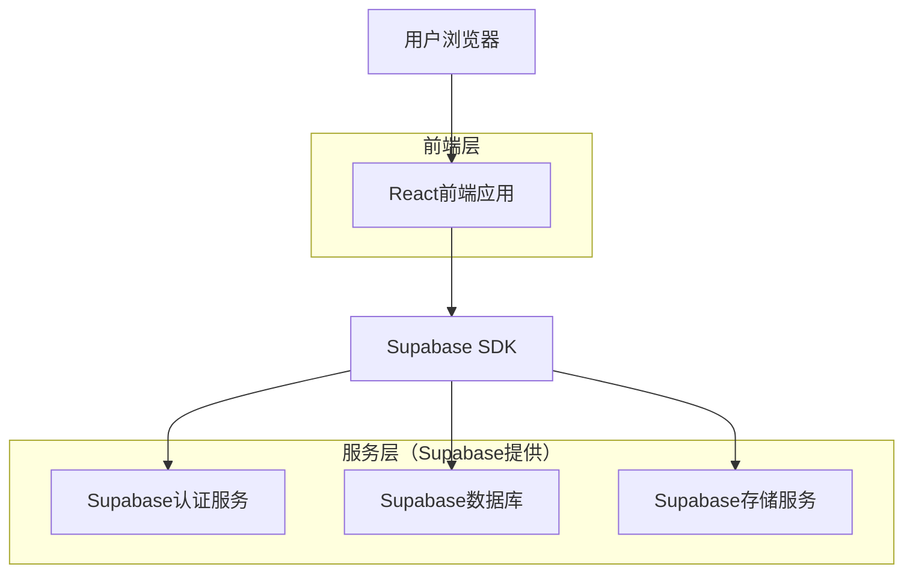

# PMSY技术架构文档

## 版本信息
- **版本**: 2.0
- **更新日期**: 2026-02-10
- **状态**: 已同步代码实现

---

## 1. 架构设计



---

## 2. 技术栈

### 2.1 前端技术栈

| 技术 | 版本 | 用途 |
|------|------|------|
| React | 18.3.1 | UI框架 |
| TypeScript | 5.8.3 | 类型系统 |
| Vite | 6.3.5 | 构建工具 |
| Tailwind CSS | 3.4.17 | CSS框架 |
| React Router | 7.3.0 | 路由管理 |
| Lucide React | 0.511.0 | 图标库 |
| Radix UI | 最新版 | 基础UI组件 |
| Recharts | 3.7.0 | 图表库 |
| date-fns | 4.1.0 | 日期处理 |
| xlsx | 0.18.5 | Excel处理 |
| docx | 9.5.1 | Word文档生成 |

### 2.2 后端技术栈

| 技术 | 用途 |
|------|------|
| Supabase | BaaS平台（Auth + PostgreSQL + Storage） |
| PostgreSQL | 关系型数据库 |
| Row Level Security | 数据权限控制 |

---

## 3. 项目结构

```
src/
├── components/          # 公共组件
│   ├── Layout.tsx      # 页面布局
│   ├── ProtectedRoute.tsx  # 受保护路由
│   ├── Empty.tsx       # 空状态组件
│   └── Notifications.tsx   # 通知组件
├── context/            # React Context
│   └── AuthContext.tsx # 认证上下文
├── hooks/              # 自定义Hooks
│   └── useTheme.ts     # 主题Hook
├── lib/                # 工具库
│   ├── supabase.ts     # Supabase客户端
│   └── utils.ts        # 工具函数
├── pages/              # 页面组件
│   ├── Dashboard.tsx   # 工作台首页
│   ├── Login.tsx       # 登录页
│   ├── analysis/       # 数据分析
│   ├── projects/       # 项目管理
│   ├── suppliers/      # 供应商管理
│   ├── system/         # 系统管理
│   └── tasks/          # 任务中心
├── types/              # TypeScript类型
│   └── index.ts        # 类型定义
├── App.tsx             # 应用入口
├── index.css           # 全局样式
└── main.tsx            # 主入口
```

---

## 4. 路由定义

| 路由 | 组件 | 权限 | 描述 |
|------|------|------|------|
| /login | Login | 公开 | 登录页面 |
| / | Dashboard | 需登录 | 工作台首页 |
| /projects | ProjectList | 需登录 | 项目列表 |
| /projects/new | ProjectCreate | 需登录 | 新建项目 |
| /projects/:id | ProjectDetail | 需登录 | 项目详情 |
| /tasks | TaskList | 需登录 | 任务中心 |
| /tasks/:id | TaskDetailPage | 需登录 | 任务详情 |
| /suppliers | SupplierList | 需登录 | 供应商列表 |
| /analysis | AnalysisDashboard | 需登录 | 数据分析 |
| /system | SystemSettings | 需登录 | 系统设置 |

---

## 5. 数据模型

### 5.1 核心数据表

#### profiles（用户资料表）
| 字段 | 类型 | 说明 |
|------|------|------|
| id | uuid | 主键，关联auth.users |
| username | text | 用户名 |
| full_name | text | 全名 |
| avatar_url | text | 头像URL |
| role | text | 角色：admin/user |
| email | text | 邮箱 |
| phone | text | 电话 |
| created_at | timestamptz | 创建时间 |

#### projects（项目表）
| 字段 | 类型 | 说明 |
|------|------|------|
| id | uuid | 主键 |
| name | text | 项目名称 |
| customer_name | text | 客户名称 |
| amount | decimal(15,2) | 项目金额 |
| description | text | 项目描述 |
| status | text | 状态：pending/in_progress/completed/paused |
| is_public | boolean | 是否公开 |
| manager_id | uuid | 项目经理ID |
| current_milestone_id | uuid | 当前里程碑ID |
| created_at | timestamptz | 创建时间 |
| updated_at | timestamptz | 更新时间 |

#### project_members（项目成员表）
| 字段 | 类型 | 说明 |
|------|------|------|
| id | uuid | 主键 |
| project_id | uuid | 项目ID |
| user_id | uuid | 用户ID |
| role | text | 角色：manager/member |
| joined_at | timestamptz | 加入时间 |

#### project_modules（功能模块表）
| 字段 | 类型 | 说明 |
|------|------|------|
| id | uuid | 主键 |
| project_id | uuid | 项目ID |
| parent_id | uuid | 父模块ID |
| name | text | 模块名称 |
| description | text | 模块描述 |
| status | text | 状态 |
| sort_order | integer | 排序序号 |
| level | integer | 层级 |

#### project_milestones（项目里程碑表）
| 字段 | 类型 | 说明 |
|------|------|------|
| id | uuid | 主键 |
| project_id | uuid | 项目ID |
| name | text | 阶段名称 |
| description | text | 阶段描述 |
| status | text | 状态：pending/in_progress/completed |
| phase_order | integer | 阶段顺序（1-7） |
| start_date | date | 开始日期 |
| end_date | date | 结束日期 |

#### milestone_tasks（里程碑任务表）
| 字段 | 类型 | 说明 |
|------|------|------|
| id | uuid | 主键 |
| milestone_id | uuid | 里程碑ID |
| name | text | 任务名称 |
| description | text | 任务描述 |
| is_required | boolean | 是否必选 |
| is_completed | boolean | 是否完成 |
| output_documents | jsonb | 输出文档列表 |

#### tasks（任务表）
| 字段 | 类型 | 说明 |
|------|------|------|
| id | uuid | 主键 |
| project_id | uuid | 项目ID |
| module_id | uuid | 模块ID |
| title | text | 任务标题 |
| description | text | 任务描述 |
| status | text | 状态：todo/in_progress/paused/done/canceled |
| priority | text | 优先级：low/medium/high |
| is_public | boolean | 是否公开 |
| due_date | timestamptz | 截止日期 |
| completed_at | timestamptz | 完成时间 |
| created_by | uuid | 创建人ID |
| created_at | timestamptz | 创建时间 |

#### task_assignees（任务处理人表）
| 字段 | 类型 | 说明 |
|------|------|------|
| id | uuid | 主键 |
| task_id | uuid | 任务ID |
| user_id | uuid | 用户ID |
| is_primary | boolean | 是否主要负责人 |
| assigned_at | timestamptz | 分配时间 |

#### suppliers（供应商表）
| 字段 | 类型 | 说明 |
|------|------|------|
| id | uuid | 主键 |
| name | text | 供应商名称 |
| contact_person | text | 联系人 |
| phone | text | 电话 |
| email | text | 邮箱 |
| address | text | 地址 |
| description | text | 描述 |
| status | text | 状态：active/inactive |

#### project_suppliers（项目供应商关联表）
| 字段 | 类型 | 说明 |
|------|------|------|
| id | uuid | 主键 |
| project_id | uuid | 项目ID |
| supplier_id | uuid | 供应商ID |
| contract_amount | decimal | 合同金额 |
| progress | integer | 进度百分比 |
| module_ids | uuid[] | 关联模块ID数组 |

#### risks（风险表）
| 字段 | 类型 | 说明 |
|------|------|------|
| id | uuid | 主键 |
| project_id | uuid | 项目ID |
| title | text | 风险标题 |
| description | text | 风险描述 |
| level | text | 等级：low/medium/high |
| status | text | 状态：open/handling/closed |
| owner_id | uuid | 责任人ID |
| impact | text | 影响分析 |
| mitigation_plan | text | 应对措施 |
| handling_records | jsonb | 处置记录 |

#### reports（报告表）
| 字段 | 类型 | 说明 |
|------|------|------|
| id | uuid | 主键 |
| project_id | uuid | 项目ID |
| title | text | 报告标题 |
| type | text | 类型：daily/weekly |
| status | text | 状态：draft/published |
| content | jsonb | 报告内容 |
| created_by | uuid | 创建人ID |
| created_at | timestamptz | 创建时间 |

#### hot_news（热点新闻表）
| 字段 | 类型 | 说明 |
|------|------|------|
| id | uuid | 主键 |
| title | text | 标题 |
| summary | text | 摘要 |
| url | text | 原文链接 |
| source | text | 来源 |
| keywords | text | 匹配关键词 |
| published_at | timestamptz | 发布时间 |

#### news_comments（新闻评论表）
| 字段 | 类型 | 说明 |
|------|------|------|
| id | uuid | 主键 |
| news_id | uuid | 新闻ID |
| user_id | uuid | 用户ID |
| content | text | 评论内容 |
| created_at | timestamptz | 创建时间 |

#### system_configs（系统配置表）
| 字段 | 类型 | 说明 |
|------|------|------|
| key | text | 主键 |
| value | text | 配置值 |
| description | text | 描述 |
| updated_at | timestamptz | 更新时间 |

---

## 6. 权限设计

### 6.1 Row Level Security (RLS) 策略

系统使用Supabase的RLS进行数据权限控制：

- **profiles**: 公开可读，用户可更新自己的资料
- **projects**: 成员可查看，项目经理可更新
- **其他表**: 认证用户拥有完全访问权限（开发阶段简化策略）

### 6.2 角色权限矩阵

| 功能 | 系统管理员 | 项目经理 | 团队成员 |
|------|-----------|----------|----------|
| 用户管理 | ✓ | ✗ | ✗ |
| 系统配置 | ✓ | ✗ | ✗ |
| 项目创建 | ✓ | ✓ | ✗ |
| 项目编辑 | ✓ | ✓(自己的) | ✗ |
| 任务创建 | ✓ | ✓ | ✓ |
| 供应商管理 | ✓ | ✓ | ✓ |

---

## 7. 核心业务逻辑

### 7.1 项目创建流程

1. 创建项目记录
2. 将创建者添加为项目经理（project_members）
3. 初始化7个里程碑阶段（project_milestones）
4. 为每个阶段创建对应的必选任务（milestone_tasks）
5. 更新项目的current_milestone_id

### 7.2 任务分配流程

1. 创建任务记录
2. 添加任务处理人（task_assignees）
3. 第一个处理人设为主要负责人（is_primary=true）
4. 通知处理人

### 7.3 里程碑阶段定义

系统内置7个标准里程碑阶段：

1. **进场前阶段** - 项目启动前的内部筹备
2. **启动阶段** - 正式确立项目，完成资源协调
3. **实施阶段** - 项目交付的核心阶段
4. **初验阶段** - 项目成果初步验收
5. **试运行阶段** - 系统稳定运行和财务结算
6. **终验阶段** - 项目最终交付
7. **运维阶段** - 项目正式移交运维

---

## 8. 接口规范

### 8.1 API风格

- 使用Supabase客户端直接操作数据库
- 通过RLS控制数据访问权限
- 实时订阅通过Supabase Realtime

### 8.2 前端数据获取模式

```typescript
// 示例：获取项目列表
const { data, error } = await supabase
  .from('projects')
  .select(`
    *,
    milestones:project_milestones(status, name),
    modules:project_modules(status),
    risks(level, status),
    members:project_members(count)
  `)
  .order('created_at', { ascending: false });
```

---

## 9. 部署架构

### 9.1 开发环境

```bash
# 启动开发服务器
npm run dev
# 同时启动前端和后端（通过concurrently）
```

### 9.2 生产部署

- **前端**: 可部署到Vercel/Netlify等静态托管平台
- **后端**: Supabase托管，无需额外部署

---

## 10. 修订记录

| 版本 | 日期 | 修订内容 | 修订人 |
|------|------|----------|--------|
| 1.0 | 2025-02-09 | 初始版本 | AI Assistant |
| 2.0 | 2026-02-10 | 同步代码实际实现，更新技术栈、数据模型、权限设计 | AI Assistant |
